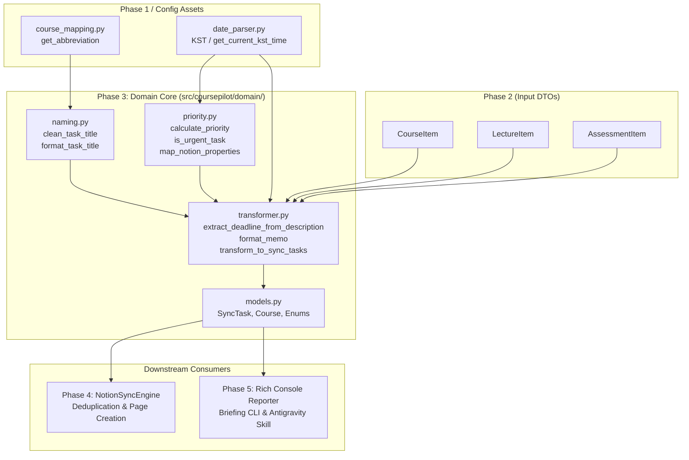

# Phase 3: Domain Modeling & Naming Rules - Research

**Researched:** 2026-09-21
**Domain:** LMS Scraped Data Normalization, Task Naming Engine, Notion Domain Modeling, 24-Hour Urgency & Priority Analysis
**Phase Requirement IDs:** DOMN-01, DOMN-02, DOMN-03
**Status:** Complete

---

<user_constraints>
## User Constraints (from CONTEXT.md)

### Locked Decisions

- **D-01:** 온라인 동영상 강의는 고정 차시 표기형 `[{과목약어}] {N}주차 {M}차시 강의 시청` 포맷을 적용 (예: `[공수2] 3주차 1차시 강의 시청`). 기존 노션 스케줄러 관례와 완전히 일치하도록 구성. — *Reversibility: costly*
- **D-02:** 과제 및 평가 활동은 유형별 동사 분기형 포맷을 적용:
  - 일반 과제: `[{과목약어}] {N}주차 {과제명} 제출`
  - 퀴즈/시험: `[{과목약어}] {N}주차 [퀴즈] {이름} 응시`
  - 토론: `[{과목약어}] {N}주차 [토론] {이름} 참여`
  — *Reversibility: costly*
- **D-03:** 과제/퀴즈 중 특정 주차에 속하지 않거나 주차 정보가 없는 공통/전체 과제는 주차 표기를 유연하게 생략하여 `[{과목약어}] {과제명} 제출`로 조건부 폴백. — *Reversibility: reversible*
- **D-04:** LMS 과제명 및 강의명은 스마트 정제를 적용하여 HTML 엔티티(`&amp;` -> `&` 등) 디코딩, 다중 공백 단일화, 교수자가 제목 앞단에 중복 기재한 `[과제]` 등의 태그를 자동 정리하여 깔끔한 작업명을 생성. — *Reversibility: reversible*
- **D-05:** 노션의 `선택` 속성은 활동 성격에 따라 자동 매핑: 동영상 강의 시청은 `루틴`, 과제/퀴즈/시험/토론은 `이벤트`로 분류. — *Reversibility: reversible*
- **D-06:** 노션의 `우선순위`(P1~P4)는 활동 유형 + 긴급도 결합형 규칙을 적용:
  - 마감 24시간 이내 미완료 항목: 무조건 `P1` (🔴 긴급) 승격
  - 평상시 과제/시험/토론: `P2` (🟠 보통/높음)
  - 평상시 동영상 강의 시청: `P3` (🟡 보통)
  - 마감 기한이 이미 지난 항목(지연): `P4` (⚪ 낮음)
  — *Reversibility: reversible*
- **D-07:** 노션 `DueDate` 필드에는 한국 표준시(KST) 기준 정확한 시:분:초를 포함한 ISO 8601 포맷(`YYYY-MM-DDTHH:MM:SS+09:00`)으로 기록하여 정확한 타임라인 알림 지원. — *Reversibility: reversible*
- **D-08:** 노션 `Plan`(계획일) 필드는 학생이 개인 스케줄에 맞춰 직접 배치할 수 있도록 초기값을 비워두고(`None`), `구분` 속성은 `["학업"]`으로 자동 설정. — *Reversibility: reversible*
- **D-09:** 동기화 기본 대상은 미완료 항목만 선별하여 반환하되, 도메인 모델(`SyncTask`) 자체는 `is_completed` 필드를 포함하여 향후 완료 상태 조회 및 리포팅 확장을 지원. — *Reversibility: reversible*
- **D-10:** 출석 인정/제출 기한이 지난 과거 미완료 항목은 노션 상태(`상태`)를 `시작 전`으로 유지. 노션 DB의 `D-Day` 수식 속성에서 오늘 날짜와 `DueDate`를 기반으로 자동으로 지연을 계산·표시하므로 작업명에 별도의 `[지연]` 태그를 붙이지 않고 깨끗한 표준 제목 유지. — *Reversibility: costly*
- **D-11:** 마감일이 없는 단순 상시 열람/OT 영상은 스케줄러 동기화 대상에서 제외. 단, LMS 정규 기한 설정이 없더라도 과제 설명란에 기한과 제출 방법(개인 메시지, 이메일 제출 등)이 적혀 있는 과제는 본문 텍스트 분석을 통해 유효 마감일을 추정/보완하여 스케줄러에 포함. — *Reversibility: reversible*
- **D-12:** 동영상 강의의 노션 `메모` 필드는 `LMS 바로가기: {link}` 형태로 단독/간결하게 구성하여 원클릭 학습 이동 지원. — *Reversibility: reversible*
- **D-13:** 과제/평가 항목의 노션 `메모` 필드는 단락을 나누어 구조화: LMS 바로가기 링크, 지각 제출 마감일(있을 시), 첨부파일 목록, 교수자 과제 설명/제출 안내 요약을 단락별로 구분하여 기록. — *Reversibility: reversible*
- **D-14:** 교수자 과제 설명문이 긴 경우 노션 API의 단일 텍스트 2000자 제한을 고려하여 1500자 초과 시 안전하게 절삭하고 말줄임표 및 `... [이하 생략 - 전체 내용은 LMS 페이지 참조]` 안내 문구를 자동 추가. — *Reversibility: reversible*
- **D-15:** Phase 3 코드는 `src/coursepilot/domain/` 서브패키지로 모듈화하여 `models.py`(도메인 엔티티), `naming.py`(작업명 규칙 포매터), `priority.py`(긴급도/우선순위/속성 매핑), `transformer.py`(원시 DTO -> SyncTask 변환기)로 명확히 역할 분리. — *Reversibility: costly*

### The Agent's Discretion

- 세부적인 과제 설명문 정규식 패턴 및 불필요한 HTML 태그 제거 로직
- 도메인 모델 유효성 검증용 Pydantic v2 필드 제약 조건 구성

### Deferred Ideas

- None — 모든 논의가 Phase 3 Domain Modeling & Naming Rules 범위 내에서 집중적으로 완료됨.

</user_constraints>

---

<phase_requirements>
## Phase Requirements

| Requirement ID | Description | Research Support Summary |
|---|---|---|
| **DOMN-01** | 수집된 데이터를 바탕으로 미완료 강의 및 미제출 과제를 정확하게 판별한다. | Phase 2 DTO(`LectureItem.status`, `AssessmentItem.status`)를 기반으로 완료(`COMPLETED`, `SUBMITTED`, `GRADED`) 여부를 검증하고, `is_completed` 플래그를 도메인 모델에 정확히 주입. 기본 동기화 변환 함수 `transform_to_sync_tasks()`에서 미완료(`is_completed=False`) 태스크만 선별 필터링하도록 구현 (D-09). |
| **DOMN-02** | 마감 24시간 이내의 미완료 항목을 감지하여 긴급도(`🔴 긴급 (P1)`) 판정 및 경고 태그를 부여한다. | KST 타임존 기반으로 `0 <= (due_date - now).total_seconds() <= 24 * 3600` 구간의 미완료 태스크를 감지하여 `TaskPriority.P1` 및 `is_urgent=True`를 부여. 과거 지연 항목(`due_date < now`)은 `P4`로 분류하여 시간 계산 오류를 차단 (D-06). |
| **DOMN-03** | 기존 노션 관례에 맞춘 통일된 이름 규칙(`[{과목약어}] {주차}주차 강의 시청`, `[{과목약어}] {과제명} 제출`)으로 작업명을 정규화한다. | 과목 약칭 매핑 로더(`course_mapping.py`)와 연동하여 동영상 강의는 `[{과목약어}] {N}주차 {M}차시 강의 시청`, 과제/평가는 유형별 동사 분기(`제출`/`응시`/`참여`) 및 주차 폴백을 적용하고, 스마트 정제(HTML unescape, 다중 공백 및 중복 접두사 제거)를 수행하는 `naming.py` 포매터 구현 (D-01 ~ D-04). |

</phase_requirements>

---

## Summary

Phase 3는 Phase 2에서 수집된 원시 스크래퍼 DTO(`CourseItem`, `LectureItem`, `AssessmentItem`)를 사용자의 개인 Notion Scheduler DB(`21d53280-64be-80ec-af4e-000b679f03bb`) 및 Phase 5의 CLI Rich 리포터가 직접 소비할 수 있는 표준 비즈니스 도메인 모델(`SyncTask`)로 변환·정규화하는 순수 도메인 계층(Pure Domain Layer)입니다.

이 계층은 외부 I/O(브라우저 탐색, 노션 네트워크 호출)와 완전히 격리된 순수 파이썬 비즈니스 로직으로 설계되며, 4개의 단일 책임 모듈(`models.py`, `naming.py`, `priority.py`, `transformer.py`)로 구성됩니다:
1. **도메인 엔티티 (`models.py`)**: Pydantic v2 기반의 엄격한 타입 정의 (`SyncTask`, `Course`, `TaskType`, `TaskPriority`, `TaskSelect`, `TaskStatus`). KST 타임존 일관성 보장 및 노션 속성 직렬화 지원.
2. **작업명 네이밍 포매터 (`naming.py`)**: 사용자 노션 DB의 기존 관례를 완벽하게 계승하는 템플릿 엔진. 과목 약칭 접두사 결합, 주차/차시 표준 표기, 활동 유형별 동사(`시청`/`제출`/`응시`/`참여`) 분기, HTML 엔티티 정제, 제목 내 중복 태그 및 접두사 정리.
3. **우선순위 및 속성 매핑 엔진 (`priority.py`)**: KST 기준 잔여 시간 계산을 통한 24시간 마감 임박(`P1`) 판정, 활동 성격별 기본 우선순위(`P2`/`P3`), 과거 지연 항목(`P4`), 노션 속성(`선택`: 루틴/이벤트, `구분`: ["학업"], `상태`: "시작 전") 매핑.
4. **DTO 변환 및 데이터 정규화기 (`transformer.py`)**: DTO -> `SyncTask` 변환, 상시 열람 영상 필터링, 과제 설명란 텍스트 정규식 분석을 통한 마감일 구출(D-11), 1500자 안전 절삭 및 단락 구조화 노션 메모 생성(D-12~D-14), 미완료 항목 선별 필터링.

---

## Architectural Responsibility Map



### Module Responsibilities

| Module | Primary Responsibility | Key Inputs | Key Outputs / Types |
|---|---|---|---|
| [`models.py`](../../../src/coursepilot/domain/models.py) | Pydantic v2 기반 도메인 모델 및 상태/우선순위/선택 Enum 정의 | 필드 값 (타이틀, 마감일, 우선순위 등) | `SyncTask`, `Course`, `TaskType`, `TaskPriority`, `TaskSelect`, `TaskStatus` |
| [`naming.py`](../../../src/coursepilot/domain/naming.py) | 작업명 정규화, 주차/차시 번호 추출, HTML 엔티티 제거, 중복 태그 정제 | 과목명, 원본 제목, 주차, 차시, 활동유형, 약칭 매핑 | 정규화된 작업명 문자열 (e.g. `[공수2] 3주차 1차시 강의 시청`) |
| [`priority.py`](../../../src/coursepilot/domain/priority.py) | 잔여 마감 기한 계산, 24시간 마감 임박(`P1`) 판정, 노션 속성 매핑 | `TaskType`, `due_date`, `is_completed`, `now (KST)` | `TaskPriority`, `TaskSelect`, `TaskStatus`, `is_urgent`, `is_overdue` |
| [`transformer.py`](../../../src/coursepilot/domain/transformer.py) | 스크래퍼 DTO -> `SyncTask` 변환, 설명란 기한 구출, 메모 페이로드 구성 및 1500자 절삭 | `CourseItem`, `LectureItem`, `AssessmentItem` 목록 | `list[SyncTask]` (정렬 및 필터링 완료) |

---

## Standard Stack

### Core Dependencies

| Package | Version Range | Purpose in Phase 3 | Status |
|---|---|---|---|
| `pydantic` | `>=2.6.0` | 도메인 엔티티 정의, 데이터 검증, KST 타임존 검증기(`field_validator`) | 이미 `pyproject.toml`에 포함되어 설치됨 |
| `python` standard library (`datetime`, `re`, `html`, `enum`, `zoneinfo`) | `>=3.11` | 날짜/시간 연산, KST 시간대 처리, 정규식 파싱, HTML 디코딩, 열거형 모델링 | 기본 제공 |
| `beautifulsoup4` | `>=4.12.0` | 과제 본문 HTML 내 불필요한 마크업 정리 및 텍스트 추출 | 이미 설치됨 |

### Supporting Codebase Assets

| Module | Location | Reusable Functionality |
|---|---|---|
| `course_mapping.py` | `src/coursepilot/course_mapping.py` | `get_abbreviation(course_name, mappings)`: 노션 관례에 맞는 축약 과목 접두사 생성 |
| `date_parser.py` | `src/coursepilot/scraper/date_parser.py` | `KST`, `get_current_kst_time()`, `parse_lms_date()`, `is_past_deadline()`: 시간 연산 및 설명란 날짜 파싱 |
| `models.py` (Scraper) | `src/coursepilot/scraper/models.py` | `CourseItem`, `LectureItem`, `AssessmentItem`, `AttendanceStatus`, `SubmissionStatus`, `AssessmentType`: 입력 DTO 계층 |

### Package Legitimacy & Alternatives Considered

- **Pydantic v2 vs Python `@dataclass`**: 프로젝트는 이미 Scraper DTO에서 Pydantic v2 `BaseModel`을 표준으로 채택하고 있습니다. Pydantic v2는 직렬화, 타입 강제, 유효성 검사, 추후 Notion API 페이로드 변환 시 `.model_dump()`를 통한 손쉬운 딕셔너리 변환을 제공하므로 도메인 모델에서도 Pydantic v2를 유지합니다.
- **HTML 정제기 (`bleach` vs `BeautifulSoup` + `html.unescape`)**: 별도의 무거운 HTML sanitize 라이브러리(`bleach`)를 추가하지 않고, 이미 설치된 `beautifulsoup4`의 `get_text(separator="\n", strip=True)` 및 표준 라이브러리 `html.unescape`로 텍스트를 추출하고 1500자 안전 절삭을 수행합니다.

---

## Architecture Patterns

### Pattern 1: Pure Domain Model Pattern (격리된 순수 도메인 계층)

도메인 모델 계층(`src/coursepilot/domain/`)은 네트워크 I/O(Playwright 브라우저, Notion HTTP API, DB 연결)를 일절 포함하지 않는 **순수 함수 및 데이터 모델**로만 작성됩니다.
- 입력: 원시 데이터 객체(`CourseItem`, `LectureItem`, `AssessmentItem`) 및 현재 시간(`datetime`)
- 출력: 정규화된 `SyncTask` 컬렉션
- 이점: 브라우저나 외부 노션 API 모킹 없이 100% 빠르고 결정론적인(deterministic) 단위 테스트 수행 가능.

### Pattern 2: Template-Method / Strategy Naming Engine

작업명 생성은 활동 유형에 따른 전략적 템플릿 방식을 따릅니다:

```python
# Naming Template Table
# Type 1: Lecture (D-01)
#   Format: "[{과목약어}] {week}주차 {clip}차시 강의 시청"
# Type 2: Assignment (D-02, D-03)
#   Format with week:    "[{과목약어}] {week}주차 {과제명} 제출"
#   Format without week: "[{과목약어}] {과제명} 제출"
# Type 3: Quiz/Exam (D-02, D-03)
#   Format with week:    "[{과목약어}] {week}주차 [퀴즈] {이름} 응시"
#   Format without week: "[{과목약어}] [퀴즈] {이름} 응시"
# Type 4: Forum (D-02, D-03)
#   Format with week:    "[{과목약어}] {week}주차 [토론] {이름} 참여"
#   Format without week: "[{과목약어}] [토론] {이름} 참여"
```

### Pattern 3: Explicit Urgency Decision Ladder

우선순위 판정 로직은 판정 순서가 결과에 결정적인 영향을 미칩니다 (D-06):

```
Decision Ladder:
1. Is task completed?
   -> is_completed = True: Priority = P4, is_urgent = False
2. Is due_date None?
   -> Lecture: Priority = P3
   -> Assessment: Priority = P2
3. Is due_date in the past? (due_date < now)
   -> is_overdue = True: Priority = P4 (⚪ 지연), is_urgent = False
4. Is remaining time <= 24 hours? (0 <= due_date - now <= 24 hours)
   -> is_urgent = True: Priority = P1 (🔴 긴급)
5. Normal pending tasks (> 24 hours remaining):
   -> Lecture: Priority = P3 (🟡 보통)
   -> Assessment (Assignment/Quiz/Forum): Priority = P2 (🟠 보통/높음)
```

### Pattern 4: Fallback & Defensive Truncation for Notion Safety

노션 API의 `rich_text` 속성은 단일 블록 당 2000자를 초과하면 `400 Bad Request` 에러를 발생시킵니다 (D-14).
- 과제 설명문이 1500자를 초과하는 경우:
  `truncated = text[:1500] + "\n... [이하 생략 - 전체 내용은 LMS 페이지 참조]"`
- 최종 `memo` 문자열 전체 길이에 대해서도 1950자 상한 하드캡을 적용하여 Notion API 호출 실패를 원천 방지합니다.

---

## Don't Hand-Roll

| Problem | Don't Hand-Roll | Use Instead | Why |
|---|---|---|---|
| HTML 엔티티 디코딩 | 문자열 단순 `.replace("&amp;", "&")` 수동 나열 | `html.unescape()` (표준 라이브러리) | `&quot;`, `&#39;`, `&lt;`, `&gt;`, `&nbsp;` 등 수백 종의 HTML 엔티티를 한 번에 안전하게 변환 |
| HTML 태그 제거 | 복잡하고 취약한 regex `<.*?>` | `BeautifulSoup.get_text(separator="\n", strip=True)` | 깨진 마크업, 중첩된 `<script>`나 `<style>` 태그, 줄바꿈 서식을 자연스럽게 처리 |
| 타임존 비교 | 로컬 머신 시각 `datetime.now()` 단순 사용 | `src/coursepilot/scraper/date_parser.py`의 `KST` 및 `get_current_kst_time()` | 로컬 머신의 타임존(UTC 등)과 KST(UTC+9)가 다를 경우 9시간의 마감 시차 오류 발생 |
| 날짜 문자열 파싱 | 커스텀 날짜 파싱 재구현 | `src/coursepilot/scraper/date_parser.py`의 `parse_lms_date()` | Phase 2에서 이미 검증된 다양한 한국 대학 LMS 날짜 포맷 및 범위(`~`) 파싱 로직 내장 |
| 과목 축약어 매핑 | 딕셔너리 하드코딩 | `src/coursepilot/course_mapping.py`의 `get_abbreviation()` | 사용자 정의 설정(`config/course_mappings.json`) 로드 및 미등록 과목 안전 폴백 지원 |

---

## Common Pitfalls

### Pitfall 1: Double-Verb Suffix ("제출 제출", "응시 응시")
- **증상**: 교수자가 LMS에 과제명을 `2주차 실습과제 제출` 또는 `중간 퀴즈 응시`로 등록한 경우, 템플릿에서 끝에 `제출`을 덧붙여 `[과목] 2주차 실습과제 제출 제출`이 생성됨.
- **원인**: 제목 끝부분의 중복 동사를 검사하지 않고 무조건 템플릿 접미사를 결합함.
- **해결책**: `clean_task_title()` 또는 포매터에서 제목 끝에 존재하는 타겟 동사(`제출`, `응시`, `참여`, `시청`)를 정규식 `re.sub(r"\s*(?:제출|응시|참여|시청)$", "", title)`로 사전 제거 후 템플릿 적용.

### Pitfall 2: Overdue vs Imminent Calculation Order
- **증상**: 이미 마감된 과거 과제(예: 어제 마감)의 남은 시간 차이 `(due_date - now)`를 계산할 때, `abs(due_date - now) <= 24h`나 단순 부등식을 사용하여 마감 지난 항목이 `P1`(긴급)으로 잘못 승격됨.
- **원인**: 음수 시간차(과거)를 긴급 임박(미래 24시간 이내)과 분리하지 않음.
- **해결책**: 반드시 `due_date < now` (과거 지연) 조건을 **먼저** 평가하여 `P4`로 처리하고, 그 다음 `0 <= (due_date - now).total_seconds() <= 24 * 3600` 구간에 대해서만 `P1`을 부여함.

### Pitfall 3: Substring Redundancy in Task Names ("3주차 3주차 과제")
- **증상**: 교수자가 과제명을 `3주차 과제: 행렬`로 적어둔 경우, 주차 파싱 결과와 결합하여 `[공수2] 3주차 3주차 과제: 행렬 제출`과 같은 어색한 중복이 발생.
- **원인**: 원본 제목에 포함된 `3주차`, `제3주`, `Week 3` 등의 주차 키워드를 정제하지 않고 주차 번호 템플릿과 중복 병합함.
- **해결책**: 정규식을 통해 제목 앞단의 `(?:제?\s*\d+\s*주차?|week\s*\d+)\s*[:\-_]?\s*` 패턴을 감지하여 주차 번호를 추출하고, 남은 과제명 본문에서는 해당 주차 접두사를 깔끔히 제거. 만약 제거 후 남은 문자열이 비어있거나 "과제"만 남는다면 적절한 폴백(예: "과제") 유지.

### Pitfall 4: Naive Date Regex False Positives in Description Parsing
- **증상**: 과제 설명란에 "교재: 2021년 3월 출판", "참고 링크: 2020-05-10" 등의 텍스트가 있을 때 이를 과제 마감일로 오인하여 5년 전 날짜를 마감일로 주입함.
- **원인**: 마감 제출 문맥 키워드(`제출`, `마감`, `까지`, `기한`, `이메일`, `쪽지`) 없이 날짜 포맷만 무차별 추출함.
- **해결책**: 마감일 추출 정규식은 반드시 `(제출|마감|기한|까지)` 문맥과 결합된 패턴만 탐색하고, 파싱된 연도가 과거(예: `year < current_year`)인 경우 무효화 처리.

### Pitfall 5: Notion API Rich Text 2000 Character Hard Limit
- **증상**: 과제 설명문이 매우 긴 과목(예: 프로그래밍 과제 가이드라인, 논문 작성 요령 등)을 동기화할 때 Notion API에서 `validation_error` (HTTP 400: `rich_text length exceeds 2000 characters`)가 발생하여 동기화 전체가 중단됨.
- **원인**: 노션 API의 문자열 길이 제한(2000자)을 사전 방어하지 않음.
- **해결책**: D-14에 명시된 대로 설명문 본문 1500자 초과 시 절삭 및 `... [이하 생략 - 전체 내용은 LMS 페이지 참조]` 추가. 또한 전체 `memo`의 최종 길이를 검사하여 1950자 초과 시 강제 절삭.

---

## Code Examples

### 1. Domain Entities (`src/coursepilot/domain/models.py`)

```python
"""Domain models for CoursePilot task synchronization."""

from datetime import datetime
from enum import Enum
from pydantic import BaseModel, Field, field_validator

from coursepilot.scraper.date_parser import KST
from coursepilot.scraper.models import AssessmentItem, CourseItem, LectureItem


class TaskType(str, Enum):
    """Activity type of a task."""
    LECTURE = "lecture"
    ASSIGNMENT = "assignment"
    QUIZ = "quiz"
    FORUM = "forum"
    OTHER = "other"


class TaskPriority(str, Enum):
    """Notion priority level (D-06)."""
    P1 = "P1"  # 🔴 Urgent: <= 24 hours to deadline
    P2 = "P2"  # 🟠 Normal: Default for assessments/quizzes/forums
    P3 = "P3"  # 🟡 Normal: Default for video lectures
    P4 = "P4"  # ⚪ Low: Overdue items


class TaskSelect(str, Enum):
    """Notion '선택' select property (D-05)."""
    ROUTINE = "루틴"  # Video lectures
    EVENT = "이벤트"    # Assignments, quizzes, exams, forums


class TaskStatus(str, Enum):
    """Notion '상태' status property (D-10)."""
    NOT_STARTED = "시작 전"
    IN_PROGRESS = "진행 중"
    COMPLETED = "완료"
    DISCARDED = "폐기"


class SyncTask(BaseModel):
    """Unified domain entity representing a schedulable task for Notion."""
    id: str
    course_id: str
    course_name: str
    course_abbr: str
    title: str
    raw_title: str
    task_type: TaskType
    selection: TaskSelect
    category: list[str] = Field(default_factory=lambda: ["학업"])
    due_date: datetime | None = None
    plan_date: datetime | None = None  # None by default (D-08)
    priority: TaskPriority
    status: TaskStatus = TaskStatus.NOT_STARTED
    memo: str = ""
    is_completed: bool = False
    is_overdue: bool = False
    is_urgent: bool = False
    source_url: str = ""
    week_number: int | None = None
    clip_number: int | None = None

    @field_validator("due_date", "plan_date", mode="after")
    @classmethod
    def ensure_kst(cls, v: datetime | None) -> datetime | None:
        """Ensures that datetimes have KST timezone attached."""
        if v is not None and v.tzinfo is None:
            return v.replace(tzinfo=KST)
        return v

    @property
    def dedup_key(self) -> str:
        """Returns a stable deduplication key for Notion matching (Phase 4)."""
        due_str = self.due_date.strftime("%Y-%m-%d %H:%M") if self.due_date else "no_due"
        return f"{self.title}|{due_str}"


class Course(BaseModel):
    """Domain model representing a course with its activities and tasks."""
    course_id: str
    name: str
    abbreviation: str
    url: str = ""
    term: str = ""
    lectures: list[LectureItem] = Field(default_factory=list)
    assessments: list[AssessmentItem] = Field(default_factory=list)
    tasks: list[SyncTask] = Field(default_factory=list)
```

### 2. Task Naming Formatter (`src/coursepilot/domain/naming.py`)

```python
"""Task naming rules and smart title cleaning engine (D-01 ~ D-04)."""

import html
import re

from coursepilot.course_mapping import get_abbreviation
from coursepilot.domain.models import TaskType


def clean_task_title(raw_title: str) -> str:
    """Cleans activity title by unescaping HTML, normalizing whitespace, and removing redundant tags."""
    if not raw_title:
        return ""

    # 1. Unescape HTML entities (&amp;, &lt;, &gt;, &quot;, &#39;, &nbsp;, etc.)
    text = html.unescape(raw_title)
    text = text.replace("\xa0", " ")

    # 2. Strip redundant bracket tags at beginning or end
    # e.g., [과제], [숙제], [Assignment], [HW], [퀴즈], [Quiz], [토론], [Discussion]
    redundant_tag_pattern = (
        r"^\[\s*(?:과제|과제제출|숙제|Assignment|HW|H\.W|퀴즈|Quiz|쪽지시험|시험|Exam|토론|Forum|Discussion)\s*\]\s*"
    )
    text = re.sub(redundant_tag_pattern, "", text, flags=re.I)

    # 3. Normalize multiple whitespace
    text = re.sub(r"\s+", " ", text).strip()
    return text


def extract_week_and_title(title: str) -> tuple[int | None, str]:
    """Extracts week number if present in the title and returns cleaned remainder title."""
    cleaned = clean_task_title(title)

    # Detect week pattern e.g. "3주차 과제", "3주차: 실습 1", "Week 4 Project"
    m_week = re.search(r"(?:제?\s*(\d+)\s*주차?|week\s*(\d+))\s*[:\-_]?\s*", cleaned, re.I)
    if m_week:
        week_num = int(m_week.group(1) or m_week.group(2))
        # Remove week prefix
        remainder = cleaned[:m_week.start()] + cleaned[m_week.end():]
        remainder = re.sub(r"\s+", " ", remainder).strip()
        # If remainder is empty or just "과제", fallback gracefully
        if not remainder:
            remainder = "과제"
        return week_num, remainder

    return None, cleaned


def format_task_title(
    course_name: str,
    raw_title: str,
    task_type: TaskType,
    week_number: int | None = None,
    clip_number: int | None = None,
    course_mappings: dict[str, str] | None = None,
) -> str:
    """Formats standardized task title according to user Notion scheduler conventions.

    Conventions:
      - Lecture: "[{과목약어}] {N}주차 {M}차시 강의 시청" (D-01)
      - Assignment: "[{과목약어}] {N}주차 {과제명} 제출" or "[{과목약어}] {과제명} 제출" (D-02, D-03)
      - Quiz: "[{과목약어}] {N}주차 [퀴즈] {이름} 응시" or "[{과목약어}] [퀴즈] {이름} 응시" (D-02, D-03)
      - Forum: "[{과목약어}] {N}주차 [토론] {이름} 참여" or "[{과목약어}] [토론] {이름} 참여" (D-02, D-03)
    """
    mappings = course_mappings if course_mappings is not None else {}
    abbr = get_abbreviation(course_name, mappings)

    # 1. Lecture
    if task_type == TaskType.LECTURE:
        w = week_number if (week_number is not None and week_number > 0) else 1
        c = clip_number if (clip_number is not None and clip_number > 0) else 1
        return f"[{abbr}] {w}주차 {c}차시 강의 시청"

    # 2. Assessments (Assignment, Quiz, Forum)
    extracted_week, clean_name = extract_week_and_title(raw_title)
    effective_week = week_number if (week_number is not None and week_number > 0) else extracted_week

    # Clean redundant trailing verb if already in clean_name to avoid "제출 제출"
    clean_name = re.sub(r"\s*(?:제출|응시|참여|시청)$", "", clean_name).strip()
    if not clean_name:
        clean_name = "과제" if task_type == TaskType.ASSIGNMENT else "활동"

    week_prefix = f"{effective_week}주차 " if (effective_week is not None and effective_week > 0) else ""

    if task_type == TaskType.ASSIGNMENT:
        return f"[{abbr}] {week_prefix}{clean_name} 제출"
    elif task_type == TaskType.QUIZ:
        return f"[{abbr}] {week_prefix}[퀴즈] {clean_name} 응시"
    elif task_type == TaskType.FORUM:
        return f"[{abbr}] {week_prefix}[토론] {clean_name} 참여"
    else:
        return f"[{abbr}] {week_prefix}{clean_name} 제출"
```

### 3. Priority and Property Mapping (`src/coursepilot/domain/priority.py`)

```python
"""Urgency, priority determination, and Notion property mapper (D-05 ~ D-08)."""

from datetime import datetime, timedelta

from coursepilot.domain.models import TaskPriority, TaskSelect, TaskStatus, TaskType
from coursepilot.scraper.date_parser import KST, get_current_kst_time


def calculate_priority(
    task_type: TaskType,
    due_date: datetime | None,
    is_completed: bool = False,
    now: datetime | None = None,
) -> tuple[TaskPriority, bool, bool]:
    """Calculates task priority and status flags (D-06).

    Returns:
        (priority, is_urgent, is_overdue)
    """
    if is_completed:
        return TaskPriority.P4, False, False

    if due_date is None:
        default_priority = TaskPriority.P3 if task_type == TaskType.LECTURE else TaskPriority.P2
        return default_priority, False, False

    current_time = now if now is not None else get_current_kst_time()
    if due_date.tzinfo is None:
        due_date = due_date.replace(tzinfo=KST)
    if current_time.tzinfo is None:
        current_time = current_time.replace(tzinfo=KST)

    # 1. Check overdue (past deadline) -> P4
    if due_date < current_time:
        return TaskPriority.P4, False, True

    # 2. Check 24-hour urgency -> P1 (DOMN-02)
    remaining_seconds = (due_date - current_time).total_seconds()
    if 0 <= remaining_seconds <= 24 * 3600:
        return TaskPriority.P1, True, False

    # 3. Normal pending tasks -> P2 (Assessment) or P3 (Lecture)
    if task_type == TaskType.LECTURE:
        return TaskPriority.P3, False, False
    else:
        return TaskPriority.P2, False, False


def get_task_selection(task_type: TaskType) -> TaskSelect:
    """Maps activity type to Notion '선택' property (D-05)."""
    if task_type == TaskType.LECTURE:
        return TaskSelect.ROUTINE
    return TaskSelect.EVENT
```

### 4. DTO Transformer & Memo Formatter (`src/coursepilot/domain/transformer.py`)

```python
"""Scraper DTO to domain SyncTask transformer with memo building and deadline rescue (D-09 ~ D-15)."""

from datetime import datetime
import re

from bs4 import BeautifulSoup

from coursepilot.course_mapping import load_course_mappings
from coursepilot.domain.models import Course, SyncTask, TaskPriority, TaskSelect, TaskStatus, TaskType
from coursepilot.domain.naming import format_task_title
from coursepilot.domain.priority import calculate_priority, get_task_selection
from coursepilot.scraper.date_parser import parse_lms_date
from coursepilot.scraper.models import (
    AssessmentItem,
    AssessmentType,
    AttendanceStatus,
    CourseItem,
    LectureItem,
    SubmissionStatus,
)


def extract_deadline_from_description(text: str) -> datetime | None:
    """Rescues deadline from assignment description when LMS has no formal due date (D-11)."""
    if not text:
        return None

    # Contextual patterns requiring submission/deadline keywords
    patterns = [
        r"(?:제출\s*기한|마감\s*일시|마감\s*기한|제출\s*마감)[:\s]*([0-9년월일\s\(\)\-./:~]+)",
        r"([0-9]{1,2}\s*월\s*[0-9]{1,2}\s*일[\s\(\)월화수목금토일]*\s*(?:자정|24시|23:59|[0-9]{1,2}:[0-9]{1,2}))\s*까지",
        r"([0-9]{4}[-./][0-9]{1,2}[-./][0-9]{1,2}\s+[0-9]{1,2}:[0-9]{1,2})\s*까지",
    ]

    for pat in patterns:
        m = re.search(pat, text, re.I)
        if m:
            date_snippet = m.group(1).strip()
            # Normalize "자정", "24시" to 23:59:59
            date_snippet = re.sub(r"(?:자정|24시)", "23:59:59", date_snippet)
            parsed_dt, _ = parse_lms_date(date_snippet)
            if parsed_dt:
                return parsed_dt

    return None


def format_memo(
    task_type: TaskType,
    url: str = "",
    cutoff_date: datetime | None = None,
    attachments: list | None = None,
    description_text: str = "",
) -> str:
    """Builds structured Notion memo payload with 1500-char safe truncation (D-12 ~ D-14)."""
    # Lecture: concise single line
    if task_type == TaskType.LECTURE:
        return f"LMS 바로가기: {url}" if url else ""

    sections: list[str] = []

    if url:
        sections.append(f"LMS 바로가기: {url}")

    if cutoff_date:
        cutoff_str = cutoff_date.strftime("%Y-%m-%d %H:%M:%S (KST)")
        sections.append(f"지각 제출 마감: {cutoff_str}")

    if attachments:
        att_lines = ["첨부파일:"]
        for att in attachments:
            size_str = f" ({att.filesize})" if getattr(att, "filesize", "") else ""
            att_lines.append(f"- {att.filename}{size_str}: {att.url}")
        sections.append("\n".join(att_lines))

    if description_text:
        cleaned_desc = description_text.strip()
        if len(cleaned_desc) > 1500:
            cleaned_desc = cleaned_desc[:1500] + "\n... [이하 생략 - 전체 내용은 LMS 페이지 참조]"
        sections.append(f"과제 안내:\n{cleaned_desc}")

    memo_text = "\n\n".join(sections).strip()
    # Hard safety cap under Notion 2000-char limit
    if len(memo_text) > 1950:
        memo_text = memo_text[:1900] + "\n... [내용 초과 절삭]"
    return memo_text


def transform_lecture_to_task(
    course: CourseItem,
    lecture: LectureItem,
    mappings: dict[str, str],
    now: datetime | None = None,
) -> SyncTask | None:
    """Transforms LectureItem to SyncTask. Returns None if unassigned/no-due-date (D-11)."""
    # Exclude open/OT videos without deadline
    if lecture.due_date is None:
        return None

    is_completed = (lecture.status == AttendanceStatus.COMPLETED)
    priority, is_urgent, is_overdue = calculate_priority(
        task_type=TaskType.LECTURE,
        due_date=lecture.due_date,
        is_completed=is_completed,
        now=now,
    )

    title = format_task_title(
        course_name=course.clean_name,
        raw_title=lecture.title,
        task_type=TaskType.LECTURE,
        week_number=lecture.week_number,
        clip_number=lecture.clip_number,
        course_mappings=mappings,
    )

    memo = format_memo(TaskType.LECTURE, url=lecture.link)

    return SyncTask(
        id=f"lec_{course.course_id}_{lecture.week_number}_{lecture.clip_number}",
        course_id=course.course_id,
        course_name=course.clean_name,
        course_abbr=mappings.get(course.clean_name, course.clean_name),
        title=title,
        raw_title=lecture.title,
        task_type=TaskType.LECTURE,
        selection=TaskSelect.ROUTINE,
        category=["학업"],
        due_date=lecture.due_date,
        priority=priority,
        status=TaskStatus.COMPLETED if is_completed else TaskStatus.NOT_STARTED,
        memo=memo,
        is_completed=is_completed,
        is_overdue=is_overdue,
        is_urgent=is_urgent,
        source_url=lecture.link,
        week_number=lecture.week_number,
        clip_number=lecture.clip_number,
    )


def transform_assessment_to_task(
    course: CourseItem,
    assessment: AssessmentItem,
    mappings: dict[str, str],
    now: datetime | None = None,
) -> SyncTask | None:
    """Transforms AssessmentItem to SyncTask with deadline rescue (D-11)."""
    due_date = assessment.due_date
    if due_date is None:
        # Try rescue from description
        due_date = extract_deadline_from_description(assessment.description_text)

    # Map AssessmentType to TaskType
    type_map = {
        AssessmentType.ASSIGNMENT: TaskType.ASSIGNMENT,
        AssessmentType.QUIZ: TaskType.QUIZ,
        AssessmentType.FORUM: TaskType.FORUM,
    }
    task_type = type_map.get(assessment.item_type, TaskType.ASSIGNMENT)

    is_completed = assessment.status in (SubmissionStatus.SUBMITTED, SubmissionStatus.GRADED)
    priority, is_urgent, is_overdue = calculate_priority(
        task_type=task_type,
        due_date=due_date,
        is_completed=is_completed,
        now=now,
    )

    title = format_task_title(
        course_name=course.clean_name,
        raw_title=assessment.title,
        task_type=task_type,
        course_mappings=mappings,
    )

    memo = format_memo(
        task_type=task_type,
        url=assessment.url,
        cutoff_date=assessment.cutoff_date,
        attachments=assessment.attachments,
        description_text=assessment.description_text,
    )

    return SyncTask(
        id=f"assess_{course.course_id}_{assessment.item_id}",
        course_id=course.course_id,
        course_name=course.clean_name,
        course_abbr=mappings.get(course.clean_name, course.clean_name),
        title=title,
        raw_title=assessment.title,
        task_type=task_type,
        selection=TaskSelect.EVENT,
        category=["학업"],
        due_date=due_date,
        priority=priority,
        status=TaskStatus.COMPLETED if is_completed else TaskStatus.NOT_STARTED,
        memo=memo,
        is_completed=is_completed,
        is_overdue=is_overdue,
        is_urgent=is_urgent,
        source_url=assessment.url,
    )


def transform_to_sync_tasks(
    courses: list[CourseItem],
    lectures_by_course: dict[str, list[LectureItem]],
    assessments_by_course: dict[str, list[AssessmentItem]],
    include_completed: bool = False,
    mappings: dict[str, str] | None = None,
    now: datetime | None = None,
) -> list[SyncTask]:
    """Transforms all collected course activities into normalized SyncTasks (D-09).

    Sorts resulting tasks by due_date (earliest first, None last).
    """
    active_mappings = mappings if mappings is not None else load_course_mappings()
    tasks: list[SyncTask] = []

    for course in courses:
        cid = course.course_id

        for lec in lectures_by_course.get(cid, []):
            task = transform_lecture_to_task(course, lec, active_mappings, now=now)
            if task is not None:
                if include_completed or not task.is_completed:
                    tasks.append(task)

        for assess in assessments_by_course.get(cid, []):
            task = transform_assessment_to_task(course, assess, active_mappings, now=now)
            if task is not None:
                if include_completed or not task.is_completed:
                    tasks.append(task)

    # Sort: tasks with deadline first (ascending), tasks without deadline last
    tasks.sort(key=lambda t: (t.due_date is None, t.due_date or datetime.max.replace(tzinfo=t.due_date.tzinfo if t.due_date else None)))
    return tasks
```

---

## Validation Architecture

### Test Framework
- Test framework: `pytest` (v8.0.0+)
- Runner command: `uv run pytest`
- Configuration: `pyproject.toml` (`[tool.pytest.ini_options]` with `pythonpath = ["src"]`, `testpaths = ["tests"]`)

### Test Suite Structure

```
tests/
├── test_domain_models.py       # Pydantic v2 validation, KST tz validator, Enums, dedup_key
├── test_naming.py              # Title formatting, clean_task_title, week extraction, double-verb prevention
├── test_priority.py            # Urgency boundaries (24h), overdue check, default priority, Notion property mapping
└── test_transformer.py         # Lecture/Assessment conversion, description deadline rescue, memo formatting & 1500-char truncation
```

### Test Map & Coverage Target

| Module Under Test | Test File | Key Test Cases |
|---|---|---|
| `domain/models.py` | `test_domain_models.py` | - SyncTask field defaults & validation<br/>- KST timezone auto-assignment<br/>- TaskType/TaskPriority/TaskSelect/TaskStatus Enum values<br/>- `dedup_key` stability and correctness |
| `domain/naming.py` | `test_naming.py` | - `[공수2] 3주차 1차시 강의 시청` (D-01)<br/>- `[공수2] 3주차 행렬 연산 과제 제출` (D-02)<br/>- `[공수2] [퀴즈] 쪽지시험 응시` (D-02, D-03)<br/>- `[공수2] [토론] AI 윤리 참여` (D-02)<br/>- Fallback for non-week items: `[자구] 1차 과제 제출` (D-03)<br/>- 스마트 정제: HTML 엔티티(`&amp;` -> `&`), 다중 공백 제거 (D-04)<br/>- 중복 접두사(`[과제]`, `[Assignment]`) 제거 (D-04)<br/>- 동사 중복 방지 (`과제 제출 제출` -> `과제 제출`)<br/>- 미등록 과목 원본 이름 폴백 |
| `domain/priority.py` | `test_priority.py` | - Remaining time <= 24h: `P1`, `is_urgent=True` (DOMN-02)<br/>- Exact 24h boundary (24h exact, 24h + 1s)<br/>- Past deadline (`due_date < now`): `P4`, `is_overdue=True`, `is_urgent=False`<br/>- Pending assignment (> 24h): `P2`<br/>- Pending lecture (> 24h): `P3`<br/>- Completed item: `P4`, `is_urgent=False`<br/>- Notion property mappings: Lecture -> `루틴`, Assessment -> `이벤트` (D-05) |
| `domain/transformer.py` | `test_transformer.py` | - Lecture without deadline exclusion (D-11)<br/>- Assessment deadline rescue from description (D-11)<br/>- Memo: Lecture single-line URL (D-12)<br/>- Memo: Assessment structured sections (URL, cut-off, attachments, description) (D-13)<br/>- Memo: 1500-char truncation with `... [이하 생략]` (D-14)<br/>- Memo: Hard cap under 1950 characters<br/>- Batch filtering: `include_completed=False` excludes completed tasks (D-09)<br/>- Batch sorting: Earliest deadline first |

### Wave 0 Gaps & Readiness
- Phase 1 & 2 tests currently pass (59 passed in 0.76s).
- All Phase 3 logic consists of pure functions and deterministic models; no Playwright browser sessions or Notion HTTP mock servers are required for Phase 3 tests.
- All new tests can execute within < 0.5s in `pytest`.

---

## Security Domain

### Threat Modeling & Safeguards

| Threat / Risk | Mitigation Strategy | Location |
|---|---|---|
| **Notion API 400 Bad Request (Payload Size)** | Notion API rejects rich_text over 2000 characters. We enforce a 1500-character truncation threshold on descriptions and a 1950-character hard limit on total memo size. | `domain/transformer.py` (`format_memo`) |
| **XSS / Broken Markup in Descriptions** | LMS professors may include unclosed HTML tags or inline styles. We use `BeautifulSoup.get_text(separator="\n")` to strip raw HTML tags safely, preventing malformed text. | `scraper/assessment_parser.py`, `domain/transformer.py` |
| **Timezone Inconsistency (Leaked UTC/Local Time)** | Comparing naive datetimes with KST can lead to a 9-hour offset error. The domain model validator enforces KST timezone on all `datetime` fields. | `domain/models.py` (`ensure_kst`), `domain/priority.py` |
| **Session / Token Leak in Memo** | LMS URLs stored in memo are restricted to canonical resource URLs (e.g. `/mod/assign/view.php?id=...`). Authentication tokens/cookies are strictly managed in Phase 1's `session.json` and never embedded in domain models. | `domain/transformer.py` |
| **Non-deterministic Deduplication Keys** | If task names differ between runs, deduplication in Phase 4 would fail, resulting in duplicate Notion pages. Naming formatting is purely functional and deterministic. | `domain/naming.py`, `domain/models.py` (`dedup_key`) |

---

*Research prepared for Phase 3 planning.*
