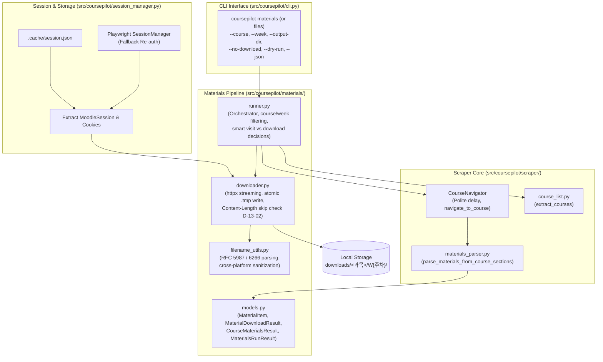

# Phase 13: Learning Materials (ubfile) Auto-Completion & File Downloader - Pattern Map

**Generated:** 2026-09-25  
**Phase:** 13 — Learning Materials (`ubfile`) Auto-Completion & File Downloader  
**Goal:** Map codebase patterns, conventions, existing analogs, and concrete code excerpts for all files to be created and modified in Phase 13.

---

## 1. Architectural Blueprint & Component Flow

Phase 13 introduces automated completion of unviewed course materials (`ubfile` and Moodle `resource`) and a hierarchical document downloader. The data flow follows the established pipeline architecture in `coursepilot`:



---

## 2. Component Analog & Pattern Directory

| Target File to Create/Modify | Role & Data Flow | Closest Existing Codebase Analog | Key Pattern / Responsibility to Follow |
|---|---|---|---|
| [`src/coursepilot/materials/models.py`](../../../src/coursepilot/materials/models.py) | DTO models for materials, download statuses, course results, and run summary | [`src/coursepilot/player/models.py`](../../../src/coursepilot/player/models.py) & [`src/coursepilot/scraper/models.py`](../../../src/coursepilot/scraper/models.py) | Pydantic `BaseModel`, `str, Enum` statuses, JSON serialization, default values |
| [`src/coursepilot/scraper/materials_parser.py`](../../../src/coursepilot/scraper/materials_parser.py) | Section parsing for `ubfile`/`resource` activities and completion status extraction | [`src/coursepilot/scraper/lecture_parser.py`](../../../src/coursepilot/scraper/lecture_parser.py) | BeautifulSoup `"lxml"` parsing, DOM week grouping, title cleaning, completion badges |
| [`src/coursepilot/materials/filename_utils.py`](../../../src/coursepilot/materials/filename_utils.py) | RFC 5987/6266 `Content-Disposition` header parsing, MIME type inference, OS filename sanitization | [`src/coursepilot/scraper/course_list.py`](../../../src/coursepilot/scraper/course_list.py) (`clean_course_name`) & [`src/coursepilot/domain/naming.py`](../../../src/coursepilot/domain/naming.py) | Pure regex transformations, percent-decoding (`urllib.parse.unquote`), Windows reserved filename safety |
| [`src/coursepilot/materials/downloader.py`](../../../src/coursepilot/materials/downloader.py) | Cookie-authenticated HTTP client, streaming download, atomic rename (`.tmp`), size deduplication (D-13-02), embedded HTML fallback | [`src/coursepilot/session_manager.py`](../../../src/coursepilot/session_manager.py) & [`src/coursepilot/player/vod_player.py`](../../../src/coursepilot/player/vod_player.py) | `httpx.Client(stream=True)`, atomic `Path.replace()`, error cleanup, session cookie extraction |
| [`src/coursepilot/materials/runner.py`](../../../src/coursepilot/materials/runner.py) | High-level orchestrator across courses and weeks, smart visit vs download decision, progress reporting, dry-run evaluation | [`src/coursepilot/player/runner.py`](../../../src/coursepilot/player/runner.py) (`watch_course_vods`) | Fuzzy course matching, week resolution, progress callbacks, exception boundaries, summary aggregation |
| [`src/coursepilot/cli.py`](../../../src/coursepilot/cli.py) | Click CLI command `materials` (and `files` alias), option wiring (`--course`, `--week`, `--output-dir`, `--no-download`, `--dry-run`, `--json`) | [`src/coursepilot/cli.py`](../../../src/coursepilot/cli.py) (`watch_group`, `check`) | Click command decorators, stream separation (`stderr=True` for progress, stdout for result/JSON), exit codes |
| [`src/coursepilot/config.py`](../../../src/coursepilot/config.py) | Add `download_dir: Path = Path("downloads")` configuration | [`src/coursepilot/config.py`](../../../src/coursepilot/config.py) (`Settings`) | Pydantic Settings `Field(default=..., description=...)` |
| [`tests/test_material_models.py`](../../../tests/test_material_models.py) | Unit tests for material models and JSON serialization | [`tests/test_vod_player.py`](../../../tests/test_vod_player.py) (`test_playback_models_defaults`) | Pytest assertions on model defaults, serialization, and enum values |
| [`tests/test_material_parser.py`](../../../tests/test_material_parser.py) | Unit tests for parsing HTML course sections for `ubfile`/`resource` | [`tests/test_lecture_parser.py`](../../../tests/test_lecture_parser.py) | HTML fixtures, extraction verification (module IDs, titles, weeks, completion status) |
| [`tests/test_filename_utils.py`](../../../tests/test_filename_utils.py) | Unit tests for RFC 5987 decoding and cross-platform sanitization | [`tests/test_course_list.py`](../../../tests/test_course_list.py) & [`tests/test_domain_naming.py`](../../../tests/test_domain_naming.py) | Parameterized test cases for UTF-8 RFC 5987 headers, Windows reserved words (`CON`, `PRN`), invalid path chars |
| [`tests/test_material_downloader.py`](../../../tests/test_material_downloader.py) | Unit tests for streaming download, size comparison, skip, atomic rename, failure rollback | [`tests/test_vod_player.py`](../../../tests/test_vod_player.py) & `httpx` mock tests | `unittest.mock.MagicMock` on `httpx.Client.stream`, `tmp_path` filesystem verification |
| [`tests/test_materials_runner.py`](../../../tests/test_materials_runner.py) | Pipeline test for multi-course, single-course, week filters, `--dry-run`, `--no-download` | [`tests/test_watch_runner.py`](../../../tests/test_watch_runner.py) (`test_watch_course_vods_dry_run`) | Mocking `extract_courses`, parser, and downloader; verifying call counts and return models |
| [`tests/test_cli_materials.py`](../../../tests/test_cli_materials.py) | CLI invocation tests for `materials` and `files` commands | [`tests/test_watch_runner.py`](../../../tests/test_watch_runner.py) (CLI tests) & [`tests/test_cli.py`](../../../tests/test_cli.py) | `click.testing.CliRunner`, `--json` deserialization, flag checking, exit codes |

---

## 3. Detailed Concrete Code Excerpts & Patterns

### 3.1 Model Pattern: DTOs & Status Enums
**Analog Source:** [`src/coursepilot/player/models.py`](../../../src/coursepilot/player/models.py#L8-L30) & [`src/coursepilot/scraper/models.py`](../../../src/coursepilot/scraper/models.py#L8-L24)

```python
# Existing Pattern in player/models.py
from enum import Enum
from pydantic import BaseModel, Field

class MaterialStatus(str, Enum):
    """Execution status for an individual learning material."""
    DOWNLOADED = "downloaded"
    SKIPPED = "skipped"
    VIEWED_ONLY = "viewed_only"
    FAILED = "failed"

class MaterialItem(BaseModel):
    """Represents a course learning material item (ubfile or resource)."""
    course_id: str
    course_name: str
    week_number: int
    module_id: str
    title: str
    url: str  # e.g., https://lxp.kau.ac.kr/mod/ubfile/view.php?id=12345
    is_completed: bool = False
    download_url: str = ""
    suggested_filename: str = ""

class MaterialDownloadResult(BaseModel):
    """Result of processing an individual material item."""
    item: MaterialItem
    status: MaterialStatus
    filename: str = ""
    saved_path: str = ""
    filesize: int = 0
    view_success: bool = False
    error_message: str | None = None

class CourseMaterialsResult(BaseModel):
    """Aggregated materials result for a single course."""
    course_id: str
    course_name: str
    target_week: str
    items: list[MaterialDownloadResult] = Field(default_factory=list)

class MaterialsRunResult(BaseModel):
    """Overall outcome of a materials CLI command execution."""
    total_courses: int = 0
    total_materials: int = 0
    downloaded_count: int = 0
    skipped_count: int = 0
    viewed_count: int = 0
    failed_count: int = 0
    dry_run: bool = False
    no_download: bool = False
    courses: list[CourseMaterialsResult] = Field(default_factory=list)
```

### 3.2 Parser Pattern: Section Navigation & Activity Extraction
**Analog Source:** [`src/coursepilot/scraper/lecture_parser.py`](../../../src/coursepilot/scraper/lecture_parser.py#L200-L245) & [`src/coursepilot/scraper/lecture_parser.py`](../../../src/coursepilot/scraper/lecture_parser.py#L326-L345)

```python
# Existing Pattern in scraper/lecture_parser.py:
# 1. Finding sections with class / id patterns:
sections = soup.find_all(
    lambda t: t.name == "li"
    and (
        any(cls in ("section", "course-section") for cls in t.get("class", []))
        or (t.get("id") and re.match(r"^section-\d+$", t.get("id")))
    )
)

# 2. Week number extraction using existing helper _parse_week_number:
heading = sec.find(class_=re.compile(r"sectionname|section-title", re.I)) or sec.find(["h3", "h4", "h5"])
if heading:
    parsed_w = _parse_week_number(heading.get_text(strip=True), default=None)
    if parsed_w is not None:
        week_num = parsed_w

# 3. Activity filtering for ubfile and resource:
activities = sec.find_all(
    lambda t: t.name == "li"
    and any(cls == "activity" for cls in t.get("class", []))
    and any(cls in ("ubfile", "modtype_ubfile", "resource", "modtype_resource") for cls in t.get("class", []))
)

# 4. Deepcopy title cleanup stripping .accesshide:
name_el = a_el.find("span", class_="instancename") or a_el
name_copy = copy.deepcopy(name_el)
for ah in name_copy.find_all(class_="accesshide"):
    ah.decompose()
raw_title = name_copy.get_text(strip=True)
title = re.sub(r"\s+", " ", raw_title).strip()

# 5. Activity completion detection from DOM:
act_classes = " ".join(act.get("class", []))
is_completed = "activity-complete" in act_classes or "iscompleted" in act_classes
```

### 3.3 Filename Utility Pattern: RFC 5987 / 6266 & Sanitization
**Analog Source:** [`src/coursepilot/scraper/course_list.py`](../../../src/coursepilot/scraper/course_list.py#L67-L104) & [`src/coursepilot/domain/naming.py`](../../../src/coursepilot/domain/naming.py#L1-L35)

```python
# RFC 5987 and Cross-Platform Sanitization Pattern
import mimetypes
from pathlib import Path
import re
import urllib.parse

_WINDOWS_RESERVED = {
    "CON", "PRN", "AUX", "NUL",
    *(f"COM{i}" for i in range(1, 10)),
    *(f"LPT{i}" for i in range(1, 10)),
}

def resolve_filename(
    content_disposition: str | None,
    url: str,
    default_name: str,
    content_type: str | None = None,
) -> str:
    """Extracts filename with RFC 5987 priority, URL fallback, and MIME extension."""
    if content_disposition:
        # Priority 1: RFC 5987 / RFC 6266 filename*=UTF-8''...
        m_star = re.search(r"filename\*\s*=\s*(?:UTF-8|utf-8)''([^;]+)", content_disposition, re.I)
        if m_star:
            return urllib.parse.unquote(m_star.group(1).strip("\"' "))
        
        # Priority 2: Standard filename="..."
        m_fn = re.search(r'filename\s*=\s*"?([^;"]+)"?', content_disposition, re.I)
        if m_fn:
            return urllib.parse.unquote(m_fn.group(1).strip("\"' "))

    # Priority 3: URL path basename (if contains extension and not .php)
    path_name = Path(urllib.parse.urlsplit(url).path).name
    if path_name and "." in path_name and not path_name.endswith(".php"):
        return urllib.parse.unquote(path_name)

    # Priority 4: Default name with MIME type extension fallback
    ext = mimetypes.guess_extension(content_type.split(";")[0].strip()) if content_type else None
    if not ext and content_type:
        if "hwp" in content_type:
            ext = ".hwp"
        elif "pdf" in content_type:
            ext = ".pdf"
    ext = ext or ".bin"
    return f"{default_name}{ext}" if not default_name.endswith(ext) else default_name

def sanitize_filename(filename: str) -> str:
    """Sanitizes filename removing illegal filesystem characters and Windows reserved stems."""
    cleaned = re.sub(r'[<>:"/\\|?*\x00-\x1f]+', "_", filename)
    cleaned = re.sub(r"\s+", " ", cleaned).strip()

    name_part = Path(cleaned).stem.upper()
    if name_part in _WINDOWS_RESERVED:
        cleaned = f"_{cleaned}"

    cleaned = cleaned.rstrip(". ")
    return cleaned or "downloaded_file"
```

### 3.4 Downloader Pattern: Session Cookie Reuse & Streaming with Atomic Write
**Analog Source:** [`src/coursepilot/session_manager.py`](../../../src/coursepilot/session_manager.py#L57-L67) & [`src/coursepilot/player/vod_player.py`](../../../src/coursepilot/player/vod_player.py#L50-L75)

```python
# Cookie extraction and httpx Streaming Pattern
import json
from pathlib import Path
import httpx
from coursepilot.config import Settings
from coursepilot.session_manager import SessionManager

def get_authenticated_httpx_client(
    settings: Settings,
    session_manager: SessionManager | None = None,
) -> httpx.Client:
    """Extracts session cookies from cache or active SessionManager."""
    cookies: dict[str, str] = {}
    cache_path = settings.session_cache_path

    if cache_path.exists():
        try:
            with open(cache_path, "r", encoding="utf-8") as f:
                data = json.load(f)
                for cookie in data.get("cookies", []):
                    cookies[cookie["name"]] = cookie["value"]
        except Exception:
            cookies = {}

    if not cookies or "MoodleSession" not in cookies:
        sm = session_manager or SessionManager(settings=settings)
        page = sm.get_authenticated_page()
        for cookie in page.context.cookies():
            cookies[cookie["name"]] = cookie["value"]

    return httpx.Client(
        cookies=cookies,
        headers={
            "User-Agent": (
                "Mozilla/5.0 (Windows NT 10.0; Win64; x64) AppleWebKit/537.36 "
                "(KHTML, like Gecko) Chrome/122.0.0.0 Safari/537.36"
            ),
            "Referer": settings.lms_url,
        },
        follow_redirects=True,
        timeout=30.0,
    )

def download_stream(
    client: httpx.Client,
    url: str,
    target_path: Path,
    chunk_size: int = 65536,
) -> tuple[int, bool]:
    """Streams download with Content-Length check, duplicate skip (D-13-02), and atomic .tmp rename."""
    target_path.parent.mkdir(parents=True, exist_ok=True)
    temp_path = target_path.with_suffix(target_path.suffix + ".tmp")

    with client.stream("GET", url) as response:
        response.raise_for_status()

        # Handle embedded HTML viewer pages
        content_type = response.headers.get("content-type", "")
        if "text/html" in content_type:
            html = response.read().decode("utf-8", errors="replace")
            # Extract download URL (e.g. pluginfile.php)
            real_url = extract_pluginfile_url(html, base_url=str(response.url))
            if real_url:
                return download_stream(client, real_url, target_path, chunk_size=chunk_size)
            raise ValueError(f"Could not locate download link in HTML viewer: {url}")

        content_length = response.headers.get("content-length")
        expected_bytes = int(content_length) if (content_length and content_length.isdigit()) else None

        # Size check for duplicate skip (D-13-02)
        if target_path.exists() and expected_bytes is not None:
            if target_path.stat().st_size == expected_bytes:
                return (expected_bytes, True)

        downloaded_bytes = 0
        try:
            with open(temp_path, "wb") as f:
                for chunk in response.iter_bytes(chunk_size=chunk_size):
                    f.write(chunk)
                    downloaded_bytes += len(chunk)

            if expected_bytes is not None and downloaded_bytes != expected_bytes:
                raise IOError(f"Byte mismatch: expected {expected_bytes}, received {downloaded_bytes}")

            # Atomic replace (POSIX and Windows MoveFileExW via Python 3.3+)
            temp_path.replace(target_path)
            return (downloaded_bytes, False)
        except Exception:
            temp_path.unlink(missing_ok=True)
            raise
```

### 3.5 Runner Orchestration Pattern: Fuzzy Course & Week Resolution
**Analog Source:** [`src/coursepilot/player/runner.py`](../../../src/coursepilot/player/runner.py#L44-L100) & [`src/coursepilot/player/runner.py`](../../../src/coursepilot/player/runner.py#L123-L145)

```python
# Fuzzy course matching and week resolution pattern
# 1. Fuzzy matching reuse:
from coursepilot.player.runner import find_target_course

# 2. Week resolution for materials (analogous to resolve_candidate_vods):
def resolve_candidate_materials(
    materials: list[MaterialItem],
    week_query: str | int | None = "current",
) -> tuple[str, list[MaterialItem]]:
    """Filters materials into target week."""
    if not materials:
        return ("none", [])

    w_str = str(week_query).strip().lower() if week_query is not None else "current"

    if w_str.isdigit():
        target_week = int(w_str)
        week_label = f"{target_week}주차"
        selected = [m for m in materials if m.week_number == target_week]
    elif w_str == "all":
        week_label = "전체 주차"
        selected = materials
    else:  # "current"
        # Earliest week with uncompleted materials
        uncompleted_weeks = [m.week_number for m in materials if not m.is_completed]
        if uncompleted_weeks:
            target_week = min(uncompleted_weeks)
            week_label = f"{target_week}주차"
            selected = [m for m in materials if m.week_number == target_week]
        else:
            # All complete; default to highest week
            max_week = max(m.week_number for m in materials)
            week_label = f"{max_week}주차 (완료)"
            selected = [m for m in materials if m.week_number == max_week]

    return (week_label, selected)
```

### 3.6 CLI Command Pattern: Click Options & Output Separation
**Analog Source:** [`src/coursepilot/cli.py`](../../../src/coursepilot/cli.py#L190-L320) & [`src/coursepilot/cli.py`](../../../src/coursepilot/cli.py#L60-L96)

```python
# Click command registration pattern in cli.py
@cli.command("materials")
@click.option("--course", "course_query", type=str, default=None, help="과목 이름, 약칭, 또는 과목 ID (생략 시 전체 과목)")
@click.option("--week", "week_query", type=str, default="current", show_default=True, help="주차 ('current', 'all', 또는 주차 번호)")
@click.option("--output-dir", "output_dir", type=click.Path(), default=None, help="다운로드 저장 기본 디렉터리 경로")
@click.option("--no-download", "no_download", is_flag=True, help="파일 다운로드 없이 미열람 자료의 진도율(100%) 이수만 수행")
@click.option("--dry-run", "dry_run", is_flag=True, help="실제 다운로드/열람 없이 대상 자료 목록 및 저장 경로 미리 확인")
@click.option("--json", "as_json", is_flag=True, help="결과를 JSON 형식으로 출력합니다.")
@click.option("--relogin", "relogin", is_flag=True, help="캐시된 세션을 무시하고 새로 로그인합니다.")
@click.option("--headed", "headed", is_flag=True, help="브라우저 창을 화면에 표시합니다.")
@click.pass_context
def materials_command(
    ctx: click.Context,
    course_query: str | None,
    week_query: str,
    output_dir: str | None,
    no_download: bool,
    dry_run: bool,
    as_json: bool,
    relogin: bool,
    headed: bool,
) -> None:
    """강의 자료(ubfile) 자동 열람(진도 100%) 및 로컬 다운로드를 수행합니다."""
    # Stderr for live progress, stdout for final result / JSON
    err = Console(stderr=True)
    out = Console()
    ...
```

---

## 4. Test Strategy & Test Patterns

### 4.1 Pytest Fixture & CliRunner Patterns
**Analog Source:** [`tests/test_watch_runner.py`](../../../tests/test_watch_runner.py#L177-L196) & [`tests/test_cli.py`](../../../tests/test_cli.py#L1-L40)

```python
# CLI CliRunner Pattern
from click.testing import CliRunner
from coursepilot.cli import cli

def test_cli_materials_dry_run_json(monkeypatch):
    runner = CliRunner()
    res = runner.invoke(cli, ["materials", "--course", "기초전자실험", "--dry-run", "--json"])
    assert res.exit_code == 0
    data = json.loads(res.output)
    assert data["dry_run"] is True
    assert "courses" in data
```

### 4.2 Mock Streaming Downloader Pattern
**Analog Source:** [`tests/test_vod_player.py`](../../../tests/test_vod_player.py#L25-L68)

```python
# Mocking httpx.Client.stream for download tests
from unittest.mock import MagicMock
import io

def test_download_stream_skip_when_size_matches(tmp_path):
    existing_file = tmp_path / "lecture.pdf"
    existing_file.write_bytes(b"EXISTING_CONTENT_12345")
    file_size = existing_file.stat().st_size

    mock_client = MagicMock()
    mock_response = MagicMock()
    mock_response.headers = {
        "content-type": "application/pdf",
        "content-length": str(file_size),
    }
    mock_client.stream.return_value.__enter__.return_value = mock_response

    downloaded_bytes, skipped = download_stream(mock_client, "https://lxp.kau.ac.kr/mod/ubfile/view.php?id=1", existing_file)
    assert skipped is True
    assert downloaded_bytes == file_size
```

---

## 5. Architectural & Convention Verification Checklist

Before and during Phase 13 implementation, ensure adherence to these rules:

1. **No Session Duplication:** Never prompt credentials or instantiate extra Playwright instances when cached cookies in `.cache/session.json` are valid.
2. **Stream Separation (D-11):** Always direct interactive progress notifications (`[1/5] 다운로드 중...`) to `Console(stderr=True)`. Keep stdout pure for final Rich tables or `--json` serialization (`model_dump_json()`).
3. **No Notion Pollution (D-13-07):** Materials do not have task deadlines; never inject `MaterialItem` into `NotionClient` or Notion Scheduler DB.
4. **Smart Visit vs Download (D-13-04):** Visit `view.php` only when `is_completed is False`. Download file whenever missing or size differs locally.
5. **Atomic Writes:** Always download into `<path>.tmp` and execute atomic replace upon verified byte completion.
6. **Alias Support (D-13-05):** Both `coursepilot materials` and `coursepilot files` must execute the exact same command.
