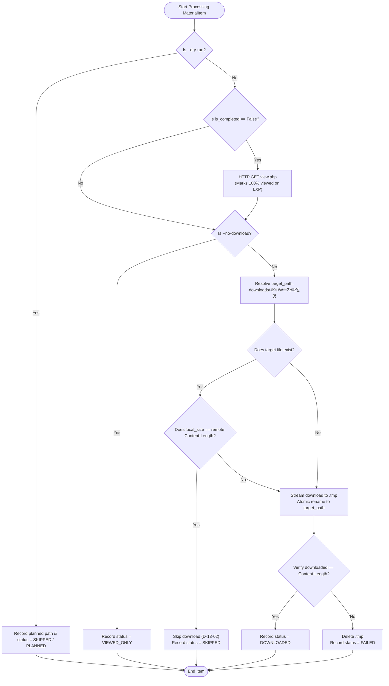

# Phase 13: Learning Materials (ubfile) Auto-Completion & File Downloader - Research

**Date:** 2026-09-25  
**Phase:** 13 — Learning Materials (ubfile) Auto-Completion & File Downloader  
**Requirements Addressed:** RES-01, RES-02  

---

<user_constraints>
## User Constraints & Phase Boundary

1. **LXP View Completion (RES-01):**
   - Automatically visit/view unviewed `ubfile` (and Moodle `resource`) activities to record 100% completion in Coursemos LXP.
   - Smart processing policy (D-13-04): Visit only '미열람' (unviewed) materials to prevent redundant server traffic, while downloading any files missing locally.
   - View-only mode (D-13-03): Support `--no-download` flag to fulfill LXP attendance/progress without saving files to disk.

2. **Hierarchical Local Downloader (RES-02):**
   - Download attached lecture documents (PDF, PPT/PPTX, ZIP, HWP/HWPX, DOCX, XLSX, etc.) into structured directories: `downloads/<과목명>/W{주차}/` (D-13-01).
   - Configurable root directory via `.env` `DOWNLOAD_DIR` and CLI option `--output-dir <경로>` (CLI option takes highest priority) (D-13-01).
   - Duplicate handling (D-13-02): Compare local file size with remote `Content-Length`. If identical, skip download; if size differs or file does not exist, overwrite.
   - Atomic writes: Stream chunks to a `.tmp` file and rename upon verified completion to prevent partial/corrupted files.

3. **CLI Interface & Notion Boundary (D-13-05..D-13-08):**
   - Provide `coursepilot materials` as the canonical command, with `files` as an alias (D-13-05).
   - Support `--course <과목명>` (fuzzy match, all courses if omitted) and `--week <current|all|N>` (D-13-06).
   - Scope isolation (D-13-07): Learning materials have no assignment deadlines, so they must NOT sync to Notion Scheduler DB.
   - Preview & Agent Integration (D-13-08): Support `--dry-run` to preview target materials, filenames, and local paths without network downloads, and `--json` for agent communication.

4. **Security & Session Re-use:**
   - Re-use authenticated session cookies from `session.json` or Playwright `SessionManager` without re-prompting for credentials.
   - Robust `Content-Disposition` RFC 5987 / RFC 6266 filename decoding (UTF-8) and cross-platform filename sanitization.
</user_constraints>

---

<architectural_responsibility_map>
## Architectural Responsibility Map

| Module / Component | Responsibility | Relevant Existing Code / New File |
|--------------------|----------------|-----------------------------------|
| `coursepilot.scraper.material_models` | Data DTOs: `MaterialItem`, `MaterialDownloadResult`, `MaterialsRunResult` | New (`src/coursepilot/scraper/material_models.py`) |
| `coursepilot.scraper.material_parser` | Course home & `ublogs` parsing for `ubfile`/`resource` activities | New (`src/coursepilot/scraper/material_parser.py`) |
| `coursepilot.materials.downloader` | Cookie extraction, streaming HTTP download, atomic file writing, size check, RFC 5987 filename parsing, sanitization | New (`src/coursepilot/materials/downloader.py`) |
| `coursepilot.materials.runner` | Orchestration across courses/weeks, smart visit vs download decision, progress reporting, dry-run evaluation | New (`src/coursepilot/materials/runner.py`) |
| `coursepilot.config` | Add `download_dir: Path = Path("downloads")` configuration | Modify (`src/coursepilot/config.py`) |
| `coursepilot.cli` | Register `materials` (and `files` alias) command with `--course`, `--week`, `--output-dir`, `--no-download`, `--dry-run`, `--json` | Modify (`src/coursepilot/cli.py`) |
| `coursepilot.reporter` | Build Rich table summary and JSON serialization for materials | Modify or New (`src/coursepilot/materials/reporter.py`) |

</architectural_responsibility_map>

---

<research_summary>
## Research Summary

### 1. Coursemos LXP `ubfile` Completion Mechanics
- **Server-side Hook:** In Coursemos (UBion's Moodle distribution), `mod/ubfile/view.php?id={cmid}` (and standard Moodle `mod/resource/view.php?id={cmid}`) implements Moodle's activity completion standard.
- **Completion Trigger:** When a student performs an authenticated HTTP GET request to `mod/ubfile/view.php?id={cmid}`, Moodle immediately executes:
  ```php
  $completion = new completion_info($course);
  $completion->set_module_viewed($cm);
  ```
  This immediately records completion (`completionstate = 1`, `viewed = 1`) in `mdl_course_modules_completion`.
- **No Heartbeat Required:** Unlike Video.js VOD playback which requires continuous 1.0x playback and progress pings, document viewing has no heartbeat. An HTTP GET to `view.php` is necessary and sufficient to trigger 100% completion.
- **Completion Detection:** Completion status can be inspected from two sources:
  1. **Course Home HTML:** `<li class="activity ... ubfile modtype_ubfile ...">` elements contain class `activity-complete` / `iscompleted` vs `activity-incomplete` (or completion check badges).
  2. **Activity Completion Report (`/report/ublogs/completion.php`):** Lists all activities with explicit "완료" vs "미완료" status and completion timestamps.

### 2. File Delivery & Extraction Patterns
When `mod/ubfile/view.php?id={cmid}` is requested:
- **Direct Download / Redirect Mode:** The server issues a `302/303 Found` redirect to `/pluginfile.php/{contextid}/mod_ubfile/content/.../{filename}` or returns `200 OK` directly with binary `Content-Type` and `Content-Disposition: attachment; filename=...`.
- **Embedded Viewer Mode:** The server returns `text/html` rendering a preview container or iframe. Within the HTML, the download URL is present as:
  - An iframe or object `src` pointing to `/pluginfile.php/...`
  - A download button `<div class="ubfile-download"><a href="...pluginfile.php...">`
  - An anchor link pointing to `/pluginfile.php/` or having a downloadable extension.
- **Resolution Strategy:** With `httpx.Client(follow_redirects=True)`, an initial `GET` to `view.php` accomplishes both LXP completion registration and file resolution. If `Content-Type` is binary, the stream is directly written. If `Content-Type` is `text/html`, BeautifulSoup extracts the `/pluginfile.php/` link and downloads it.

### 3. Download Pipeline: `httpx` Stream vs Playwright `page.expect_download()`
- **Winner: `httpx` streaming with cookies extracted from `session.json` / Playwright context.**
- **Rationale:**
  1. *Speed & Resource Efficiency:* Streaming via `httpx` is ~10-20x faster and consumes negligible memory compared to navigating heavy Chromium pages for every single PDF/PPT.
  2. *Predictable Handling:* Playwright's `expect_download()` hangs and times out if the `view.php` page renders an in-page viewer instead of an immediate browser download event.
  3. *Size Verification & Skipping (D-13-02):* `httpx.stream("GET", ...)` reads response headers first. If local file exists and matches `headers["Content-Length"]`, the stream is closed immediately without transferring body bytes.
  4. *Atomic Writes:* Chunks (e.g. 64KB) are written to `<filename>.tmp` and atomically replaced only when download completes and size matches.

### 4. RFC 5987 / RFC 6266 & Sanitization
- Korean filenames in Coursemos headers commonly use RFC 5987 format: `filename*=UTF-8''%EC%8B%A4%ED%97%98.pdf` or quoted UTF-8 / URL-encoded `filename="...pdf"`.
- Priority for filename resolution:
  1. `filename*` parameter in `Content-Disposition` (RFC 5987/6266, unquoted via `urllib.parse.unquote`).
  2. `filename` parameter in `Content-Disposition` (unquoted).
  3. Final redirected URL path basename (`unquote(Path(url).name)`).
  4. Activity title from course page + MIME type extension mapping (`mimetypes.guess_extension` + `.hwp`/`.hwpx` fallbacks).
- Cross-platform sanitization removes illegal filesystem characters (`<>:"/\|?*`), strips Windows reserved names (`CON`, `PRN`, `AUX`, `NUL`, `COM1-9`, `LPT1-9`), trims trailing dots/spaces, and enforces 255-character limits.

</research_summary>

---

<standard_stack>
## Standard Stack & Dependencies

### Core Python Libraries
- `httpx>=0.27.0` (already installed in `.venv` as `0.28.1`): High-performance streaming HTTP client with cookie jar and redirect support.
- `beautifulsoup4>=4.12.0` and `lxml>=5.2.0`: HTML parsing for course sections, `ublogs` completion table, and embedded viewer pages.
- `pydantic>=2.6.0` & `pydantic-settings>=2.2.0`: Configuration (`DOWNLOAD_DIR`), data models, and JSON serialization.
- `click>=8.1.0` & `rich>=13.7.0`: CLI command interface and formatted terminal reporting (stderr for progress, stdout for final report/JSON).
- `playwright>=1.42.0`: Session authentication and fallback browser context when `session.json` requires refreshing.

### Dependency Status
All required packages (`httpx`, `beautifulsoup4`, `lxml`, `pydantic`, `pydantic-settings`, `click`, `rich`, `playwright`) are already installed and verified in `.venv`.

</standard_stack>

---

<architecture_patterns>
## Architecture Patterns & Component Design

### 1. Data Models (`src/coursepilot/scraper/material_models.py`)

```python
from datetime import datetime
from enum import Enum
from pathlib import Path
from pydantic import BaseModel, Field


class MaterialStatus(str, Enum):
    DOWNLOADED = "downloaded"
    SKIPPED = "skipped"
    VIEWED_ONLY = "viewed_only"
    FAILED = "failed"


class MaterialItem(BaseModel):
    """Represents a course learning material item (ubfile or resource)."""

    course_id: str
    course_name: str
    week_number: int
    module_id: str
    title: str
    url: str  # e.g., https://lxp.kau.ac.kr/mod/ubfile/view.php?id=12345
    is_completed: bool = False
    download_url: str = ""
    suggested_filename: str = ""


class MaterialDownloadResult(BaseModel):
    """Result of processing an individual material item."""

    item: MaterialItem
    status: MaterialStatus
    filename: str = ""
    saved_path: str = ""
    filesize: int = 0
    view_success: bool = False
    error_message: str | None = None


class CourseMaterialsResult(BaseModel):
    """Aggregated materials result for a single course."""

    course_id: str
    course_name: str
    target_week: str
    items: list[MaterialDownloadResult] = Field(default_factory=list)


class MaterialsRunResult(BaseModel):
    """Overall outcome of a materials CLI command execution."""

    total_courses: int = 0
    total_materials: int = 0
    downloaded_count: int = 0
    skipped_count: int = 0
    viewed_count: int = 0
    failed_count: int = 0
    dry_run: bool = False
    no_download: bool = False
    courses: list[CourseMaterialsResult] = Field(default_factory=list)
```

### 2. Materials Parser (`src/coursepilot/scraper/material_parser.py`)

```python
import copy
import re
from urllib.parse import urljoin
from bs4 import BeautifulSoup, Tag
from coursepilot.scraper.lecture_parser import _parse_week_number, clean_lecture_title
from coursepilot.scraper.material_models import MaterialItem
from coursepilot.scraper.models import CourseItem


def parse_materials_from_course_sections(html: str, course: CourseItem) -> list[MaterialItem]:
    """Extracts ubfile and resource materials from course home sections."""
    soup = BeautifulSoup(html, "lxml")
    materials: list[MaterialItem] = []

    # Identify course sections
    sections = soup.find_all(
        lambda t: t.name == "li"
        and (
            any(cls in ("section", "course-section") for cls in t.get("class", []))
            or (t.get("id") and re.match(r"^section-\d+$", t.get("id")))
        )
    )
    if not sections:
        sections = [soup]

    for sec_idx, sec in enumerate(sections):
        # Determine week number
        week_num: int = sec_idx
        heading = sec.find(class_=re.compile(r"sectionname|section-title", re.I)) or sec.find(["h3", "h4", "h5"])
        if heading:
            parsed_w = _parse_week_number(heading.get_text(strip=True), default=None)
            if parsed_w is not None:
                week_num = parsed_w

        # Find learning material activities (ubfile, resource, folder)
        activities = sec.find_all(
            lambda t: t.name == "li"
            and any(cls == "activity" for cls in t.get("class", []))
            and any(cls in ("ubfile", "modtype_ubfile", "resource", "modtype_resource") for cls in t.get("class", []))
        )

        for act in activities:
            a_el = act.find("a", href=re.compile(r"/mod/(?:ubfile|resource)/view\.php\?id=\d+"))
            if not a_el:
                continue

            href = a_el.get("href", "")
            id_match = re.search(r"[?&]id=(\d+)", href)
            module_id = id_match.group(1) if id_match else f"mat_{abs(hash(href)) % 100000}"

            # Derive title
            title_copy = copy.deepcopy(a_el)
            for ah in title_copy.find_all(class_="accesshide"):
                ah.decompose()
            inst_el = title_copy.find(class_="instancename")
            raw_title = inst_el.get_text(strip=True) if inst_el else title_copy.get_text(strip=True)
            title = re.sub(r"\s+", " ", raw_title).strip()

            # Determine initial completion from DOM class
            act_classes = " ".join(act.get("class", []))
            is_completed = "activity-complete" in act_classes or "iscompleted" in act_classes

            full_url = urljoin(course.url, href)

            materials.append(
                MaterialItem(
                    course_id=course.course_id,
                    course_name=course.clean_name,
                    week_number=week_num,
                    module_id=module_id,
                    title=title,
                    url=full_url,
                    is_completed=is_completed,
                )
            )

    return materials
```

### 3. Downloader Engine (`src/coursepilot/materials/downloader.py`)

Key responsibilities:
- Resolves cookie session from `SessionManager` or `session.json`.
- Implements `parse_content_disposition` and `sanitize_filename`.
- Manages atomic `.tmp` downloads, stream iteration, and progress hooks.
- Compares sizes for deduplication (D-13-02).
- Extracts download links from embedded HTML pages when `view.php` does not directly stream the file.

```python
def resolve_filename(
    content_disposition: str | None,
    url: str,
    default_name: str,
    content_type: str | None = None,
) -> str:
    """Extracts best-effort filename from Content-Disposition, URL path, or default name."""
    if content_disposition:
        # 1. RFC 5987 / RFC 6266: filename*=UTF-8''...
        m_star = re.search(r"filename\*\s*=\s*(?:UTF-8|utf-8)''([^;]+)", content_disposition, re.I)
        if m_star:
            return urllib.parse.unquote(m_star.group(1).strip("\"' "))
        # 2. Standard filename="..."
        m_fn = re.search(r'filename\s*=\s*"?([^;"]+)"?', content_disposition, re.I)
        if m_fn:
            return urllib.parse.unquote(m_fn.group(1).strip("\"' "))

    # 3. URL path basename
    path_name = Path(urllib.parse.urlsplit(url).path).name
    if path_name and "." in path_name and not path_name.endswith(".php"):
        return urllib.parse.unquote(path_name)

    # 4. Default name with extension inferred from content-type
    ext = mimetypes.guess_extension(content_type.split(";")[0].strip()) if content_type else None
    if not ext and content_type:
        if "hwp" in content_type:
            ext = ".hwp"
        elif "pdf" in content_type:
            ext = ".pdf"
    ext = ext or ".bin"
    return f"{default_name}{ext}" if not default_name.endswith(ext) else default_name
```

```python
def sanitize_filename(filename: str) -> str:
    """Sanitizes filename for safe storage across Windows, macOS, and Linux."""
    # Replace illegal filesystem chars
    cleaned = re.sub(r'[<>:"/\\|?*\x00-\x1f]+', "_", filename)
    cleaned = re.sub(r"\s+", " ", cleaned).strip()

    # Windows reserved filenames check
    name_part = Path(cleaned).stem.upper()
    if name_part in {"CON", "PRN", "AUX", "NUL", *(f"COM{i}" for i in range(1, 10)), *(f"LPT{i}" for i in range(1, 10))}:
        cleaned = f"_{cleaned}"

    # Strip trailing periods and spaces
    cleaned = cleaned.rstrip(". ")
    return cleaned or "downloaded_file"
```

### 4. Smart Processing & Decision Workflow (D-13-03, D-13-04)



</architecture_patterns>

---

<dont_hand_roll>
## What NOT to Hand-Roll

1. **Do NOT Hand-roll Cookie and Session Authentication:**
   - Use `SessionManager`'s cached `session.json` or its active Playwright browser context to obtain authenticated cookies.
   - Do not prompt the user for session tokens or passwords in the materials pipeline.
2. **Do NOT Hand-roll HTTP Streaming or Connection Pools:**
   - Use `httpx.Client(stream=True, follow_redirects=True)` for chunked file streaming, automatic decompression, and redirect following.
3. **Do NOT Download Files via Playwright Browser Automation:**
   - Avoid launching separate Chromium pages with `page.expect_download()` for files. It is brittle against embedded viewers, incurs massive browser overhead, and times out on non-download HTML pages.
4. **Do NOT Overwrite Files Without Size Comparison:**
   - Honor D-13-02: Check `target_path.stat().st_size == expected_bytes`. Do not blindly re-download identical multi-megabyte PDFs.
5. **Do NOT Sync Materials to Notion Scheduler:**
   - Respect D-13-07: Course materials do not possess assignment deadlines. Do not inject them into the Notion Scheduler database.

</dont_hand_roll>

---

<common_pitfalls>
## Common Pitfalls & Edge Cases

1. **Embedded Viewer Pages vs Direct Downloads:**
   - *Problem:* In Coursemos, instructors can configure a `ubfile` to be "Embed", "Open in frame", or "Force download". If "Embed", `view.php` returns an HTML page containing an iframe or download button instead of the file stream.
   - *Fix:* Inspect `response.headers["content-type"]`. If it contains `text/html`, parse the page with BeautifulSoup, find the `<a href="...pluginfile.php...">` or iframe `src`, and download from that URL.
2. **Windows File Path Limits & Reserved Names:**
   - *Problem:* Windows rejects filenames like `AUX.pdf`, `CON.hwp`, or names with colons/slashes (`2주차: 실험과제.pdf`), and fails if path exceeds 260 characters.
   - *Fix:* Sanitize reserved names by prefixing `_`, replace invalid characters with `_`, and use relative paths resolved through `Path.resolve()`.
3. **Interrupted or Partial Downloads:**
   - *Problem:* Network timeout or user abort (Ctrl+C) leaves zero-byte or half-written corrupted files. Subsequent runs see the file and incorrectly think it's complete.
   - *Fix:* Always write to a `.tmp` file (e.g. `manual.pdf.tmp`). Validate that total bytes received match `Content-Length` (if available), then execute atomic rename (`os.replace` / `Path.replace`). If an error occurs, delete the `.tmp` file.
4. **URL Encoding Quirks in Filenames (RFC 5987):**
   - *Problem:* Korean filenames in `Content-Disposition` often appear as `filename*=UTF-8''%EC%A0%9C1%EA%B0%95.pdf`. A standard regex matching `filename="(.+)"` fails or yields raw percent-encoded strings.
   - *Fix:* Prioritize `filename*=UTF-8''` pattern and decode with `urllib.parse.unquote()`.
5. **Coursemos Access Denial / Session Timeout:**
   - *Problem:* During a batch download across multiple courses, a session might expire, or a student might not be enrolled in an old course.
   - *Fix:* Check HTTP 401/403 or redirect to `/login/`. If session expires, invoke `session_manager.ensure_authenticated()` to refresh cookies and retry.

</common_pitfalls>

---

<code_examples>
## Code Examples & Integration Snippets

### 1. Reusable Cookie Extraction & HTTPX Client Initialization

```python
from pathlib import Path
import json
import httpx
from coursepilot.config import Settings
from coursepilot.session_manager import SessionManager


def get_authenticated_httpx_client(
    settings: Settings,
    session_manager: SessionManager | None = None,
) -> httpx.Client:
    """Initializes an httpx.Client with active Coursemos session cookies."""
    cookies: dict[str, str] = {}
    cache_path = settings.session_cache_path

    # Try loading from cache first
    if cache_path.exists():
        try:
            with open(cache_path, "r", encoding="utf-8") as f:
                data = json.load(f)
                for cookie in data.get("cookies", []):
                    cookies[cookie["name"]] = cookie["value"]
        except Exception:
            cookies = {}

    # If no valid cookies found, use SessionManager to login and populate cache
    if not cookies or "MoodleSession" not in cookies:
        sm = session_manager or SessionManager(settings=settings)
        page = sm.get_authenticated_page()
        context_cookies = page.context.cookies()
        for cookie in context_cookies:
            cookies[cookie["name"]] = cookie["value"]

    return httpx.Client(
        cookies=cookies,
        headers={
            "User-Agent": (
                "Mozilla/5.0 (Windows NT 10.0; Win64; x64) AppleWebKit/537.36 "
                "(KHTML, like Gecko) Chrome/122.0.0.0 Safari/537.36"
            ),
            "Referer": settings.lms_url,
        },
        follow_redirects=True,
        timeout=30.0,
    )
```

### 2. Streaming File Downloader with Atomic Write & Size Check

```python
def download_stream(
    client: httpx.Client,
    url: str,
    target_path: Path,
    chunk_size: int = 65536,
) -> tuple[int, bool]:
    """Downloads a file via streaming HTTP GET with size deduplication and atomic rename.
    
    Returns: (downloaded_bytes, was_skipped)
    """
    target_path.parent.mkdir(parents=True, exist_ok=True)
    temp_path = target_path.with_suffix(target_path.suffix + ".tmp")

    with client.stream("GET", url) as response:
        response.raise_for_status()

        # Handle embedded HTML page if view.php returned HTML
        content_type = response.headers.get("content-type", "")
        if "text/html" in content_type:
            html = response.read().decode("utf-8", errors="replace")
            # Extract download URL from html (e.g. pluginfile.php link)
            real_url = extract_pluginfile_url(html, base_url=str(response.url))
            if real_url:
                return download_stream(client, real_url, target_path, chunk_size=chunk_size)
            raise ValueError(f"Could not locate download link in HTML viewer page: {url}")

        content_length = response.headers.get("content-length")
        expected_bytes = int(content_length) if (content_length and content_length.isdigit()) else None

        # Size check for duplicate skip (D-13-02)
        if target_path.exists() and expected_bytes is not None:
            if target_path.stat().st_size == expected_bytes:
                return (expected_bytes, True)

        downloaded_bytes = 0
        try:
            with open(temp_path, "wb") as f:
                for chunk in response.iter_bytes(chunk_size=chunk_size):
                    f.write(chunk)
                    downloaded_bytes += len(chunk)

            if expected_bytes is not None and downloaded_bytes != expected_bytes:
                raise IOError(f"Byte mismatch: expected {expected_bytes}, received {downloaded_bytes}")

            temp_path.replace(target_path)
            return (downloaded_bytes, False)
        except Exception:
            temp_path.unlink(missing_ok=True)
            raise
```

---

<sota_updates>
## SOTA Updates & Python Ecosystem

- **RFC 6266 & RFC 5987 (HTTP Header Parameter Encoding):**
  - Modern web servers encode UTF-8 filenames in the `filename*` parameter using percent-encoding prefixed by `UTF-8''`.
  - While Python's `email.message.EmailMessage` can parse standard `Content-Disposition`, directly extracting `filename*=UTF-8''...` with regex + `urllib.parse.unquote` is faster, more deterministic, and avoids email library header folding idiosyncrasies.
- **Atomic File Writing on Windows:**
  - `Path.replace()` on Windows Python 3.3+ uses `MoveFileExW` with `MOVEFILE_REPLACE_EXISTING`, ensuring atomic overwrite semantics identical to POSIX.

</sota_updates>

---

<open_questions>
## Open Questions & Resolved Decisions

1. **Q: Does visiting `view.php` mark unviewed materials as 100% complete without JavaScript execution?**
   - **Answer:** Yes. Moodle and Coursemos execute activity completion triggers during PHP request processing on the server (`completion_info->set_module_viewed`). An authenticated HTTP GET request to `mod/ubfile/view.php?id=...` immediately sets the activity completion status to 100%.
2. **Q: How should week numbers be resolved if `--week current` is given?**
   - **Answer:** Consistent with Phase 12's VOD runner (`resolve_candidate_vods`), find the earliest week containing unviewed/incomplete materials. If all materials are complete, default to the latest week with materials.
3. **Q: Where should default downloads go?**
   - **Answer:** Project-relative `downloads/<과목명>/W{주차}/` by default, overridable by `.env` `DOWNLOAD_DIR` and CLI `--output-dir`.

</open_questions>

---

<sources>
## Sources & References

- Moodle Dev Docs: Activity Completion API & `completion_info::set_module_viewed()`
- RFC 6266: Use of the Content-Disposition Header Field in the Hypertext Transfer Protocol (HTTP)
- RFC 5987: Character Set and Language Encoding for Hypertext Transfer Protocol (HTTP) Header Field Parameters
- Existing Codebase:
  - `src/coursepilot/scraper/lecture_parser.py` (HTML section parsing, `_parse_week_number`, `ublogs` table extraction)
  - `src/coursepilot/scraper/navigator.py` (Navigation patterns and polite delay)
  - `src/coursepilot/session_manager.py` (Session caching and Playwright context)
  - `src/coursepilot/player/runner.py` (Fuzzy course matching, week resolution)

</sources>

---

## Validation Architecture

### 1. Test Strategy & Test Matrix

To guarantee robustness without requiring live LMS credentials during automated testing, the validation suite consists of:

| Test Module | Coverage Scope | Key Assertions / Verifications |
|-------------|----------------|--------------------------------|
| `tests/test_material_models.py` | DTO models (`MaterialItem`, `MaterialDownloadResult`, `MaterialsRunResult`) | Serialization, default values, status enum validity |
| `tests/test_material_parser.py` | Course section parsing & `ublogs` completion merging | Extract materials from `lxp_course_home_materials.html`, verify week, title, URL, initial completion status |
| `tests/test_filename_utils.py` | RFC 5987/6266 filename resolution & sanitization | Decode Korean UTF-8 `filename*`, fallback to URL/title, sanitize Windows reserved names & illegal chars |
| `tests/test_material_downloader.py` | HTTP streaming, atomic tmp replace, size deduplication | Mock `httpx.Client.stream`: verify download, skip on equal size, overwrite on size mismatch, atomic rename, cleanup on failure |
| `tests/test_materials_runner.py` | Pipeline execution, course filtering, week filtering, dry-run | Verify `--dry-run` produces zero file writes, fuzzy course matching, `--no-download` triggers view only |
| `tests/test_cli_materials.py` | Click CLI command `materials` and alias `files` | `--course`, `--week`, `--output-dir`, `--no-download`, `--dry-run`, `--json` flags and exit codes |

### 2. Automated Test Commands

```bash
# Run entire test suite including new materials tests
.\.venv\Scripts\python.exe -m pytest -ra -q

# Run Phase 13 materials tests specifically
.\.venv\Scripts\python.exe -m pytest tests/test_material_parser.py tests/test_filename_utils.py tests/test_material_downloader.py tests/test_materials_runner.py tests/test_cli_materials.py -v
```

### 3. Manual Live Verification (When credentials configured)

```bash
# 1. Preview materials for a course (Dry-run)
python -m coursepilot materials --course 기초전자실험 --dry-run

# 2. View-only mode (100% completion without downloading files)
python -m coursepilot materials --course 기초전자실험 --week current --no-download

# 3. Download materials for current week
python -m coursepilot materials --course 기초전자실험 --week current

# 4. Verify downloaded directory and file contents
# Directory: downloads/기초전자실험/W2/

# 5. Re-run download command to verify size-based skip (D-13-02)
python -m coursepilot materials --course 기초전자실험 --week current

# 6. JSON output test
python -m coursepilot materials --course 기초전자실험 --week current --json
```

---

<metadata>
Phase: 13-learning-materials-ubfile-auto-completion-file-downloader
Domain: materials-automation-downloader
Status: ready-for-planning
Author: gsd-phase-researcher
Timestamp: 2026-09-25T13:05:00+09:00
</metadata>
