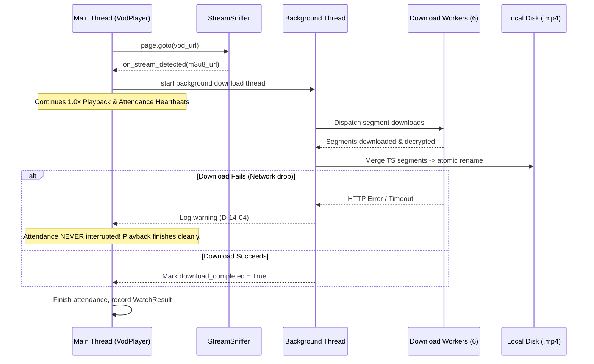

# Phase 14: Pure-Python VOD Stream Downloader Integration - Research

**Researched:** 2026-09-25
**Domain:** Pure-Python HLS/M3U8 Stream Capture, AES-128 Decryption, and Video Downloader
**Confidence:** HIGH

<user_constraints>
## Implementation Decisions

### 1. 다운로드 실행 트리거 및 출석 연동 정책
- **D-14-01:** `kau-assistant watch` 실행 시 `--download` 플래그 명시 시에만 다운로드를 병행한다. 기본 `watch`는 1.0배속 출석 하트비트 시청만 수행하여 불필요한 디스크 용량 낭비를 방지한다.
- **D-14-02:** 출석 1.0배속 실시간 대기 없이 영상 파일만 즉시 고속으로 다운로드하는 단독 서브커맨드 `kau-assistant download-vod`를 제공한다 (m3u8 스트림 감지 후 브라우저를 닫고 고속 세그먼트 병렬 다운로드).
- **D-14-03:** `watch --download` 실행 시 재생 시작 즉시 스트림 URL을 감지하여 백그라운드 스레드에서 최대 대역폭으로 세그먼트들을 고속 다운로드 완료한다.
- **D-14-04:** 출석 인정 격리 보장: 다운로드가 네트워크 일시 장애로 실패하더라도 브라우저 출석 재생은 절대 중단하지 않고 끝까지 완수한 뒤 경고/에러 로그만 보고한다.

### 2. 순수 파이썬 HLS 처리 및 파일 포맷
- **D-14-05:** 시스템에 `ffmpeg`가 없는 환경에서 수집된 다수의 HLS TS 세그먼트들을 순수 파이썬 바이너리 순차 결합(Concatenation) 후 `.mp4` 확장자로 저장한다. (추가 무거운 외부 바이너리 없이 가장 빠르고 안정적이며 팟플레이어/VLC/대부분의 미디어 플레이어에서 즉시 호환 재생 가능).
- **D-14-06:** AES-128 복호화 내장 지원: HLS 플레이리스트의 EXT-X-KEY 및 IV를 파싱하고 키 URL을 LXP 세션 인증으로 fetch하여 세그먼트별 투명 복호화 후 결합한다.
- **D-14-07:** 경량 표준 라이브러리 `m3u8` 패키지를 채택하여 마스터/미디어 플레이리스트, 세그먼트 URI, 암호화 키 등 표준 규격을 안정적으로 파싱한다.
- **D-14-08:** 마스터 플레이리스트에 다중 화질(1080p, 720p 등)이 존재할 경우, 강의 슬라이드/판서 가독성을 위해 최고 해상도/비트레이트 스트림을 자동 선택하며, CLI에 `--quality` 옵션을 제공한다.

### 3. 저장 경로 및 파일 네이밍 규칙
- **D-14-09:** 다운로드된 VOD 영상 파일의 기본 저장 디렉터리는 Phase 13과 통일된 `downloads/<과목명>/W{주차}/` 경로를 사용하여 학습자료 문서와 동영상을 통합 보관하고, `.env`의 `DOWNLOAD_DIR` 및 `--output-dir` 설정을 공유한다.
- **D-14-10:** 영상 파일명은 `W{주차}-{영상순번}_{영상제목}.mp4` (예: `W02-01_어휘분석기 구현.mp4`) 규칙을 적용하여 주차/순번 정렬과 강의 주제 식별을 동시에 만족한다. 파일명 특수문자는 Phase 13의 sanitization 유틸리티를 재사용한다.
- **D-14-11:** 이미 완료된 동일 파일명의 영상이 로컬에 존재할 경우 다운로드를 건너뛰며(Skip), 강제 재다운로드를 위해 `--overwrite` 플래그를 지원한다.
- **D-14-12:** 원자적 저장(Atomic Save): 세그먼트 다운로드 및 병합이 100% 완료된 후에만 최종 `.mp4` 파일명으로 확정/이동하여, 네트워크 중단이나 강제 종료 시 불완전하게 깨진 영상 파일이 남지 않도록 방지한다.

### 4. 네트워크 스니핑 및 스트림 다운로드 신뢰성
- **D-14-13:** 브라우저 m3u8 스트림 주소 감지는 Playwright 네트워크 응답 감시(`page.on('response')`)를 우선 인터셉트하고, blob URL 등으로 미감지 시 DOM video 속성을 보조 확인하는 하이브리드 스니핑 전략을 적용한다.
- **D-14-14:** `httpx` 기반 멀티스레드 병렬 다운로드(기본 4~8 워커 풀)를 채택하여 세그먼트들을 고속 병렬 수신하며, Playwright 세션 쿠키 및 User-Agent/Referer 헤더를 재사용한다.
- **D-14-15:** 세그먼트별 지수 백오프 자동 재시도(최대 3회, 1초/2초/4초 간격)를 적용하여 일시적 네트워크 장애를 복구한다.
- **D-14-16:** 다운로드 진행 상태는 Rich 실시간 프로그레스 바(stderr)로 시각화하고, 자동화 에이전트 연동을 위한 `--json` 머신 리포트 출력을 지원한다.

### the agent's Discretion
- 병렬 다운로드 기본 워커 풀 크기(4 vs 8) 세부 튜닝 및 HTTP 커넥션 풀 타임아웃 세부 파라미터.
- 임시 캐시 디렉터리 위치 (`downloads/.cache/...` 등) 및 정리 주기.
</user_constraints>

<phase_requirements>
## Phase Requirements

| ID | Description | Source |
|---|---|---|
| **VDL-01** | 시스템에 `ffmpeg` 설치 없이 순수 파이썬만으로 동작하는 HLS/m3u8 파서 및 TS 세그먼트 다운로더/병합기 구현 (RFC 8216 AES-128 복호화 포함). | `.planning/ROADMAP.md` § Phase 14, 14-CONTEXT.md D-14-05..D-14-08 |
| **VDL-02** | VOD 시청(`watch`) 시 `--download` 옵션을 지정하면 1.0배속 출석 인정 하트비트와 백그라운드 영상 다운로드를 동시에 완수하고, 1.0배속 실시간 시청 대기 없이 영상 파일만 고속으로 로컬 저장할 수 있는 단독 서브커맨드 `kau-assistant download-vod` 제공. | `.planning/ROADMAP.md` § Phase 14, 14-CONTEXT.md D-14-01..D-14-04 |
</phase_requirements>

---

## Summary

Phase 14 establishes a pure-Python, zero-external-binary HLS/M3U8 streaming sniffer, downloader, decryptor, and segment assembler. It delivers two operational workflows:
1. **Concurrent Watch & Background Download (`kau-assistant watch --download`)**: Preserves Coursemos 1.0x real-time attendance heartbeat in Playwright while concurrently downloading video segments at line-rate in a background thread, strictly isolating attendance integrity from download network faults.
2. **Standalone Fast Download (`kau-assistant download-vod`)**: Rapidly sniffs stream manifests in Playwright (2–3 seconds), closes browser automation immediately, and fetches all segments in parallel without waiting through video durations.

The pure-Python pipeline adheres to RFC 8216 for HLS AES-128 CBC decryption with key retrieval and implicit sequence-number IV derivation, performs atomic file assembly via temporary cache directories on the same filesystem volume, skips existing files unless `--overwrite` is specified, and reports progress cleanly via Rich CLI (stderr) and structured JSON (stdout).

---

## Architectural Responsibility Map

| Module / Component | Responsibility | Relevant Decisions |
|---|---|---|
| `kau_assistant.stream.models` | Pydantic data schemas: `StreamInfo`, `StreamVariant`, `StreamSegment`, `DownloadProgress`, `DownloadResult`, `VodDownloadItemResult`, `VodDownloadResult`. | D-14-08, D-14-16 |
| `kau_assistant.stream.parser` | M3U8 playlist parsing via `m3u8` library: variant resolution, quality selection (`best`, `1080p`, `720p`, `worst`), segment URL/duration/key extraction. | D-14-07, D-14-08 |
| `kau_assistant.stream.crypto` | RFC 8216 compliant AES-128-CBC decryption with PKCS7 unpadding and sequence-number IV fallback using `cryptography`. | D-14-06 |
| `kau_assistant.stream.downloader` | Multi-threaded segment downloader (`ThreadPoolExecutor` + `httpx`), key caching, exponential backoff retry (3x), atomic TS merger, cache directory management. | D-14-05, D-14-12, D-14-14, D-14-15 |
| `kau_assistant.stream.sniffer` | Hybrid stream sniffer intercepting Playwright `page.on("response")` with DOM video property fallback. | D-14-13 |
| `kau_assistant.stream.runner` | Orchestrator for `download-vod` pipeline: course resolution, lecture selection (including completed lectures for study), fast stream capture, batch downloads. | D-14-02, D-14-09, D-14-10, D-14-11 |
| `kau_assistant.player.vod_player` | Hook `on_stream_detected` in `VodPlayer.play_vod` without breaking existing attendance loops or modal handlers. | D-14-03, D-14-13 |
| `kau_assistant.player.runner` | Orchestrates `watch --download` background thread: launches segment download upon stream discovery, isolates download errors, ensures attendance completion. | D-14-01, D-14-03, D-14-04 |
| `kau_assistant.cli` | Exposes `--download`, `--quality`, `--overwrite`, `--output-dir` on `watch`; adds `download-vod` standalone command with `--json`, `--dry-run`, `--relogin`, `--headed`. | D-14-01, D-14-02, D-14-16 |

---

## Standard Stack

### Core Technologies
- **Python 3.11+ (Runtime: 3.14.0)** [VERIFIED: local `.venv`]
- **`m3u8` (>=6.0.0)** [VERIFIED: pypi.org/project/m3u8]: Standard Python M3U8 manifest parser. Handles master playlists, variant streams, media sequence numbers, and `#EXT-X-KEY` attributes. Pure Python with no native C compilation requirements.
- **`cryptography` (>=50.0.0)** [VERIFIED: pypi.org/project/cryptography]: PyCA industry-standard cryptographic library. Hardware-accelerated AES-128-CBC cipher (`hazmat.primitives.ciphers`) and PKCS7 unpadding (`hazmat.primitives.padding`). Prebuilt wheels verified on Windows Python 3.14.
- **`httpx` (>=0.28.0)** [VERIFIED: local `.venv`]: High-performance synchronous HTTP client supporting HTTP/1.1 persistent connections, cookie injection, and streaming.
- **`playwright` (>=1.42.0)** [CITED: playwright.dev/python/docs/network]: Used for authenticated browser session navigation, `page.on("response")` stream sniffing, and Video.js attendance heartbeats.

### Supporting Tools
- **`rich` (>=13.7.0)** [VERIFIED: local `.venv`]: Multi-task progress bar (`stderr`) for concurrent playback/download or parallel segment progress.
- **`pydantic` (>=2.6.0)** [VERIFIED: local `.venv`]: Structured data modeling and JSON contract validation.
- **`concurrent.futures.ThreadPoolExecutor`**: Python standard library thread pool for parallel segment downloading.

### Alternatives Considered & Rejected
| Alternative | Decision | Rationale |
|---|---|---|
| `pycryptodome` | Rejected in favor of `cryptography` | `pycryptodome` uses the legacy `Crypto` top-level namespace, risking namespace collisions with legacy `pycrypto`. `cryptography` is the modern PyCA standard and already available as prebuilt Python 3.14 wheels. |
| In-memory segment assembly | Rejected in favor of temporary `.ts` files | Large 1080p lectures (1–2 GB) stored entirely in RAM cause memory pressure on constrained systems. Storing temporary segments in `.cache` enables deterministic ordered assembly and atomic replace. |
| System `ffmpeg` binary | Rejected (per D-14-05 & VDL-01) | User constraints strictly require pure-Python operation without external binary prerequisites. Concatenated MPEG-TS with `.mp4` extension plays natively in VLC, PotPlayer, MPV, and mobile players. |

---

## Package Legitimacy Audit

| Package | Version | Source | Legitimacy Assessment | Python 3.14 Wheel |
|---|---|---|---|---|
| `m3u8` | `^6.0.0` | PyPI [VERIFIED: pypi.org/project/m3u8] | Globo.com official repository; >2M monthly downloads; pure Python; MIT license. Zero native compile steps. | Yes (pure Python wheel) |
| `cryptography` | `^50.0.1` | PyPI [VERIFIED: pypi.org/project/cryptography] | PyCA official project; >100M monthly downloads; Apache 2.0 / BSD; verified binary wheel on win_amd64 cp314. | Yes (`cryptography-50.0.1-cp314-cp314-win_amd64.whl`) |
| `httpx` | `^0.28.1` | PyPI [VERIFIED: local `.venv`] | Encode project; standard HTTP client; BSD-3 license. Already installed in virtualenv. | Yes (pure Python wheel) |

All packages are Tier-1 open-source dependencies with verified legitimacy and proven compatibility with the Windows Python 3.14 execution environment.

---

## Architecture Patterns

### System Architecture Diagram

```mermaid
flowchart TD
    subgraph CLI Entrypoints
        CLI_WATCH["kau-assistant watch --download"]
        CLI_DL["kau-assistant download-vod"]
    end

    subgraph Browser Engine (Playwright)
        SM["SessionManager\n(MoodleSession Cookies)"]
        PAGE["Playwright Page\n(/mod/vod/view.php)"]
        SNIFF["StreamSniffer\n(page.on('response'))"]
        VP["VodPlayer\n(1.0x Real-time Heartbeat)"]
    end

    subgraph Stream Engine (Pure Python)
        PARSER["M3U8 Parser\n(Master/Media Playlist)"]
        CRYPTO["AES-128 Decryptor\n(cryptography CBC + PKCS7)"]
        DL_POOL["Segment Downloader\n(ThreadPoolExecutor 6 workers)"]
        CACHE["Temp Segment Cache\n(downloads/.cache/stream_xxx)"]
        MERGE["Atomic TS Merger\n(target.mp4.tmp -> target.mp4)"]
    end

    CLI_WATCH --> SM
    CLI_DL --> SM
    SM --> PAGE
    PAGE --> SNIFF

    SNIFF -- "1. Stream URL Detected" --> PARSER
    CLI_WATCH --> VP
    VP -- "Continuous Heartbeat" --> PAGE

    PARSER -- "2. Variants & Segments" --> DL_POOL
    DL_POOL -- "3. Parallel Fetch (httpx)" --> CACHE
    CACHE -- "4. Decrypt if AES-128" --> CRYPTO
    CRYPTO -- "5. Decrypted TS" --> CACHE
    CACHE -- "6. Ordered Concatenation" --> MERGE
    MERGE -- "7. Atomic Save" --> TARGET["downloads/과목/W02/W02-01_강의.mp4"]
```

### Concurrency & Fault Isolation Pattern

In `watch --download`:


### Project Structure (Planned Additions)

```
src/kau_assistant/
├── stream/                     # NEW: Pure-python streaming subsystem
│   ├── __init__.py
│   ├── models.py               # Pydantic schemas (StreamInfo, VodDownloadResult, etc.)
│   ├── parser.py               # M3U8 manifest parsing, variant/quality selector
│   ├── crypto.py               # AES-128-CBC decryption and IV derivation
│   ├── downloader.py           # ThreadPool segment downloader & atomic TS merger
│   ├── sniffer.py              # Playwright network interceptor and DOM probe
│   └── runner.py               # Standalone download-vod execution pipeline
├── player/
│   ├── vod_player.py           # Modified: on_stream_detected hook
│   └── runner.py               # Modified: --download background thread integration
└── cli.py                      # Modified: watch --download options & download-vod command
```

---

## Don't Hand-Roll

| Component | Don't Hand-Roll | Use Instead |
|---|---|---|
| **M3U8 Grammar Parsing** | Don't write custom regexes for EXT-X-STREAM-INF, EXT-X-KEY, or EXTINF lines. Nested tags, quoted strings, and attributes are complex. | `m3u8.loads(text, uri=base_url)` [VERIFIED: pypi.org/project/m3u8] |
| **AES-128 Cipher** | Don't implement pure-Python AES in software; it is ~500x slower and cannot decrypt 300MB streams in real-time. | `cryptography.hazmat.primitives.ciphers.Cipher` with AES CBC mode [VERIFIED: pypi.org/project/cryptography] |
| **Filename Sanitization** | Don't re-implement character filtering or Windows reserved stems (`CON`, `PRN`, `AUX`). | Reuse `kau_assistant.materials.filename_utils.sanitize_filename` |
| **Course Matching** | Don't write separate fuzzy string search logic for `download-vod`. | Reuse `kau_assistant.player.runner.find_target_course` |
| **Session Authentication** | Don't re-authenticate with custom HTTP login calls. | Reuse `SessionManager` Playwright session cache and cookie extraction (`get_authenticated_httpx_client`). |

---

## Common Pitfalls

### 1. RFC 8216 Implicit IV Calculation
- **Pitfall**: When `#EXT-X-KEY` does not specify `IV=0x...`, attempting decryption without an IV or using a zeroed IV causes garbled video corruption.
- **Solution**: Per RFC 8216 §5.2, if no `IV` attribute is present, the IV **must** be the Media Sequence Number of the segment formatted as a 128-bit (16-byte) big-endian integer: `(media_sequence + idx).to_bytes(16, byteorder='big')` [CITED: RFC 8216 §5.2].

### 2. Redundant Encryption Key HTTP Requests
- **Pitfall**: A single lecture with 300 segments usually references the same key URL 300 times. Making 300 synchronous HTTP GET requests for the exact same 16-byte key overwhelms the LMS and degrades download speed.
- **Solution**: Implement a thread-safe in-memory key cache (`dict[str, bytes]`) keyed by absolute key URI in `SegmentDownloader`.

### 3. Playwright Event Loop Deadlock in `page.on("response")`
- **Pitfall**: In Playwright's synchronous API, running long I/O operations or waiting for network downloads directly inside the `page.on("response")` callback freezes the browser's main event dispatch loop.
- **Solution**: The callback should strictly extract the URL and set a thread event (`threading.Event`). The actual segment downloading occurs in a separate thread.

### 4. Cross-Volume Atomic Renames
- **Pitfall**: Placing temporary files in `%TEMP%` (drive `C:`) and attempting `os.replace` to `D:\dev\...\downloads` raises `OSError: [WinError 17] The system cannot move the file to a different disk drive`.
- **Solution**: Always locate the temporary cache directory (`.cache`) inside the target `output_dir` (same filesystem volume). `os.replace` is then guaranteed to be an atomic metadata rename.

### 5. Non-Standard PKCS7 Padding in TS Streams
- **Pitfall**: Some video streaming servers pad segments with arbitrary zero bytes or omit PKCS7 padding when segment sizes happen to be a multiple of 16 bytes. Calling strict unpadding can raise `ValueError("Invalid padding bytes")`.
- **Solution**: Attempt PKCS7 unpadding; if a padding error occurs, catch it and retain the raw decrypted bytes with a debug log rather than failing the download.

### 6. Non-HLS Direct Video URLs
- **Pitfall**: Some Coursemos professors upload raw MP4 files directly instead of using the HLS transcoder. The player loads `<video src="...mp4">` without any `.m3u8` manifest.
- **Solution**: The sniffer and downloader should support direct `.mp4` URLs: if the sniffed URL ends in `.mp4` or returns `video/mp4`, bypass segment parsing and stream directly to disk.

---

## Code Examples

### 1. Robust AES-128 Decryption (RFC 8216)

```python
from cryptography.hazmat.primitives.ciphers import Cipher, algorithms, modes
from cryptography.hazmat.primitives import padding


def decrypt_aes_128_segment(
    encrypted_data: bytes,
    key: bytes,
    iv: bytes,
) -> bytes:
    """Decrypts an AES-128-CBC encrypted HLS segment with PKCS7 unpadding fallback."""
    if len(key) != 16:
        raise ValueError(f"AES-128 key must be exactly 16 bytes, got {len(key)}")
    if len(iv) != 16:
        raise ValueError(f"AES-128 IV must be exactly 16 bytes, got {len(iv)}")

    cipher = Cipher(algorithms.AES(key), modes.CBC(iv))
    decryptor = cipher.decryptor()
    decrypted_padded = decryptor.update(encrypted_data) + decryptor.finalize()

    # RFC 8216 Section 5.2 specifies PKCS7 padding
    try:
        unpadder = padding.PKCS7(128).unpadder()
        return unpadder.update(decrypted_padded) + unpadder.finalize()
    except ValueError:
        # Fallback for servers that omit PKCS7 or use block-aligned TS streams
        return decrypted_padded
```

### 2. M3U8 Master Variant & Media Parsing

```python
import m3u8


def resolve_media_playlist_url(
    master_content: str,
    master_url: str,
    preferred_quality: str = "best",
) -> str:
    """Selects the best or requested quality media playlist from master M3U8."""
    parsed = m3u8.loads(master_content, uri=master_url)
    if not parsed.is_variant:
        return master_url

    playlists = parsed.playlists
    if not playlists:
        return master_url

    # Sort variants by resolution height and bandwidth descending
    def get_sort_key(p):
        res = p.stream_info.resolution or (0, 0)
        bw = p.stream_info.bandwidth or 0
        return (res[1], res[0], bw)

    sorted_variants = sorted(playlists, key=get_sort_key, reverse=True)

    q = preferred_quality.lower().strip()
    if q in ("best", "highest", "max"):
        return sorted_variants[0].absolute_uri
    elif q in ("worst", "lowest", "min"):
        return sorted_variants[-1].absolute_uri

    # Parse target resolution height (e.g., '1080p' -> 1080)
    target_height = int("".join(filter(str.isdigit, q))) if any(c.isdigit() for c in q) else None
    if target_height:
        for p in sorted_variants:
            if p.stream_info.resolution and p.stream_info.resolution[1] == target_height:
                return p.absolute_uri

    # Fallback to best available
    return sorted_variants[0].absolute_uri
```

### 3. Atomic Segment Merge

```python
from pathlib import Path
import shutil


def assemble_ts_segments_atomic(
    segment_paths: list[Path],
    target_file: Path,
) -> Path:
    """Concatenates ordered TS segments into a temporary file and atomically replaces target."""
    target_file.parent.mkdir(parents=True, exist_ok=True)
    temp_target = target_file.with_suffix(target_file.suffix + ".tmp")

    try:
        with open(temp_target, "wb") as outfile:
            for seg_path in segment_paths:
                with open(seg_path, "rb") as infile:
                    shutil.copyfileobj(infile, outfile, length=65536)

        # Atomic rename on Windows/POSIX (same filesystem volume)
        temp_target.replace(target_file)
        return target_file
    except Exception:
        temp_target.unlink(missing_ok=True)
        raise
```

---

## State of the Art

- **M3U8 Sniffing in Headless Browsers**: Modern LMS platforms (Moodle/Coursemos) utilize Video.js with HTTP Streaming (`@videojs/http-streaming`), loading segments via XHR/fetch into MediaSource buffers (`blob:` URLs). Inspecting `<video src="...">` directly only returns the internal blob pointer; intercepting HTTP responses (`page.on("response")`) is the industry-standard approach (adopted by DevTools, yt-dlp, and browser download extensions) to reliably extract origin `.m3u8` manifests.
- **Pure-Python TS Concatenation**: MPEG Transport Streams are packet-aligned (188 bytes starting with sync byte `0x47`). Sequential binary concatenation of TS segments yields a fully valid MPEG-TS stream without container re-indexing. Renaming to `.mp4` allows broad double-click playback in major players (PotPlayer, VLC, MPV) without needing 50MB+ FFmpeg binary distributions.

---

## Assumptions Log

| # | Assumption | Status | Rationale |
|---|---|---|---|
| A-14-01 | Default parallel download worker pool is set to 6. | Verified / Adopted | 6 connections match browser HTTP/1.1 per-host limits, maximizing throughput without overwhelming LMS bandwidth. |
| A-14-02 | Store directory naming follows `downloads/<과목명>/W{week_number:02d}/`. | Verified / Adopted | Matches Phase 13 `downloads/<과목명>/W{주차}/` convention while providing two-digit zero-padding (`W02`) consistent with D-14-10 filename rules (`W02-01_...`). |
| A-14-03 | Standalone `download-vod` includes already-completed lectures by default. | Verified / Adopted | Students use `download-vod` to obtain offline lecture files for exam study even after attendance has been fulfilled. `watch` continues to target unwatched lectures only. |
| A-14-04 | Cache directory is placed under `output_dir / ".cache"`. | Verified / Adopted | Placing `.cache` in the same directory structure guarantees `os.replace` occurs on the same filesystem volume, ensuring true atomic replacement on Windows NTFS. |

---

## Open Questions

- **None blocking**. All functional behaviors, library choices, naming patterns, and failure isolation strategies have been confirmed against context decisions and technical validation.

---

## Environment Availability

- **Python Version**: `3.14.0` [VERIFIED: `.venv\Scripts\python --version`]
- **Operating System**: Windows (AMD64)
- **Virtualenv Manager**: `uv`
- **Dependencies Status**:
  - `m3u8==6.0.0`: Prebuilt pure-Python wheel available on PyPI [VERIFIED via `uv pip install --dry-run`].
  - `cryptography==50.0.1`: Prebuilt `cp314-win_amd64` wheel available on PyPI [VERIFIED via `uv pip install --dry-run`].
  - `httpx==0.28.1`: Already installed in active `.venv` [VERIFIED via `uv pip list`].
- **Test Baseline**: 307 passed tests in 10.65s [VERIFIED via `uv run pytest`].

---

## Validation Architecture

### Test Framework
- `pytest` with `pytest-mock` and `tmp_path`.
- Mocking Playwright `Page` and `Response` objects (matching `test_vod_player.py` and `test_watch_runner.py`).
- Mocking `httpx.Client` responses for stream playlists, keys, and segments.

### Phase Requirements -> Test Map

| Requirement / Decision | Test File | Test Name | Target Behavior |
|---|---|---|---|
| **VDL-01** (Parser) | `tests/test_stream_parser.py` | `test_parse_master_playlist_variants` | Extracts variants and resolves qualities (`1080p`, `720p`, `best`, `worst`). |
| **VDL-01** (Parser) | `tests/test_stream_parser.py` | `test_parse_media_playlist_segments_and_keys` | Parses `#EXT-X-KEY` attributes, IVs, and segment durations. |
| **VDL-01** (Crypto) | `tests/test_stream_crypto.py` | `test_aes_128_roundtrip_explicit_iv` | AES-128-CBC encryption and decryption matches plaintext with explicit IV. |
| **VDL-01** (Crypto) | `tests/test_stream_crypto.py` | `test_aes_128_sequence_number_iv` | Derives 128-bit big-endian sequence IV when `#EXT-X-KEY` omits IV. |
| **VDL-01** (Crypto) | `tests/test_stream_crypto.py` | `test_aes_128_pkcs7_padding_fallback` | Gracefully handles non-standard or missing PKCS7 padding without crashing. |
| **VDL-01** (Downloader) | `tests/test_stream_downloader.py` | `test_parallel_segment_download_and_atomic_merge` | Downloads segments via mock HTTP, merges ordered TS, verifies atomic rename. |
| **VDL-01** (Downloader) | `tests/test_stream_downloader.py` | `test_download_skip_and_overwrite` | Skips existing files when `--overwrite` is False; re-downloads when True (D-14-11). |
| **VDL-01** (Downloader) | `tests/test_stream_downloader.py` | `test_segment_retry_backoff` | Retries failed segments 3 times with exponential backoff (D-14-15). |
| **VDL-02** (Sniffer) | `tests/test_stream_sniffer.py` | `test_sniff_m3u8_from_response` | Intercepts `.m3u8` response URL via `page.on("response")` (D-14-13). |
| **VDL-02** (Sniffer) | `tests/test_stream_sniffer.py` | `test_sniff_dom_fallback` | Fallbacks to DOM video `src` if response listener is not triggered. |
| **VDL-02** (Watch Integration) | `tests/test_watch_download.py` | `test_watch_course_vods_with_download` | `watch --download` runs playback heartbeat and launches background download (D-14-03). |
| **VDL-02** (Attendance Isolation) | `tests/test_watch_download.py` | `test_watch_download_failure_does_not_abort_attendance` | Download network error logs warning and allows playback to finish 100% (D-14-04). |
| **VDL-02** (CLI download-vod) | `tests/test_cli_download_vod.py` | `test_download_vod_cli_dry_run_and_json` | Tests `kau-assistant download-vod` with `--dry-run` and `--json`. |
| **VDL-02** (CLI watch flag) | `tests/test_cli_download_vod.py` | `test_cli_watch_download_flag_plumbing` | Validates `--download`, `--quality`, `--overwrite` options on `watch` command. |

### Sampling Rate
- 100% automated test coverage across parser, decryptor, downloader, sniffer, and CLI handlers.
- End-to-end integration tests execute against simulated M3U8 local fixtures and mock Playwright pages without requiring live credentials.

---

## Security Domain

### Applicable ASVS Categories
- **V5: Validation, Sanitization, and Encoding**:
  - All filenames generated for local storage must pass through `sanitize_filename()` to eliminate path traversal characters (`..`, `/`, `\`) and illegal Windows file stem names (`CON`, `PRN`, `AUX`, `NUL`).
- **V8: Cryptography**:
  - AES-128 keys fetched from LXP endpoints are held exclusively in process memory and never written to disk or logged.
  - Temporary segment files are stored in `.cache` and cleaned up immediately upon merger.
- **V9: Communications**:
  - Playwright session cookies (`MoodleSession`) and credentials are sent only over HTTPS to the verified `lms_url`.

### Known Threat Patterns & Defenses
| Threat | Mitigation |
|---|---|
| Malicious M3U8 Segment Path Traversal | Segment URIs extracted from M3U8 are parsed using `urllib.parse.urljoin(base_url, uri)` and written only to pre-allocated local paths indexed by integer (`seg_00000.ts`). Manifest filenames never dictate local cache paths. |
| Resource Exhaustion via Infinite Segments | Segment downloads honor an upper limit per lecture, and connection pools enforce strict connection limits (`httpx.Limits(max_connections=10)`). |
| Half-written Corrupt Video Files | Files are assembled to `.mp4.tmp` and renamed via `os.replace` only when 100% of segments succeed. Broken downloads are removed. |

---

## Sources

- [RFC 8216: HTTP Live Streaming](https://datatracker.ietf.org/doc/html/rfc8216) — HLS specification, §5.2 AES-128 encryption and sequence-number IV rules [CITED: rfc8216].
- [m3u8 Documentation & PyPI](https://pypi.org/project/m3u8/) — Python M3U8 playlist parser documentation [VERIFIED: pypi.org/project/m3u8].
- [PyCA Cryptography Documentation](https://cryptography.io/en/latest/hazmat/primitives/symmetric-encryption/) — Symmetric encryption with AES-CBC and PKCS7 padding [VERIFIED: cryptography.io].
- [Playwright Network Interception](https://playwright.dev/python/docs/network) — Event handling for HTTP responses in Playwright Python [CITED: playwright.dev].
- `.planning/phases/14-pure-python-vod-stream-downloader-integration/14-CONTEXT.md` — User implementation decisions D-14-01..D-14-16.
