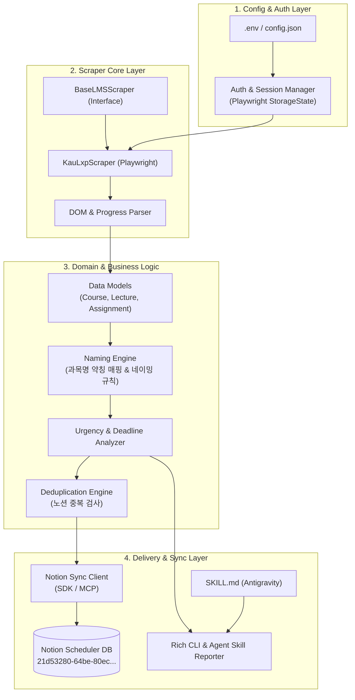

# Architecture & System Design

## System Overview

KAU LXP Assistant는 **4개 계층(Layer)**으로 구성된 모듈식 아키텍처를 따릅니다.

## Component Breakdown

### 1. Config & Session Layer
- **`config.py`**: 환경변수(`.env`), 대상 LMS URL, 계정 정보, 노션 토큰 및 DB ID 로드.
- **`session_manager.py`**: Playwright의 `browser_context.storage_state(path="session.json")`를 관리하여 매 실행마다 재로그인하는 오버헤드를 줄이고 세션 만료 시에만 재로그인 수행.

### 2. Scraper Core Layer
- **`base.py`**: LMS 스크래퍼 공통 추상 클래스 (`login()`, `get_courses()`, `get_course_activities()`). 추후 다른 학교 LMS(Canvas, Moodle 등) 확장을 위한 표준 인터페이스 제공.
- **`kau_lxp.py`**: 한국항공대 LXP 및 유사 Canvas 기반 학습 사이트의 로그인 폼 제출, 강좌 대시보드 접근, 주차별 강의 목록(비디오 재생 상태, 출석 완료 여부, 마감일) 및 과제 페이지 크롤링.
- **`date_parser.py`**: LMS 내 다양한 문자열 날짜 포맷을 표준 Python `datetime` (KST) 객체로 파싱.

### 3. Domain Logic
- **`models.py`**:
  - `Course`: 과목 ID, 과목명, 교수명, URL
  - `LectureItem`: 주차, 강의명, 수강 완료 여부(진행률), 마감일시, URL
  - `AssignmentItem`: 과제명, 제출 여부, 마감일시, URL
  - `SyncTask`: 노션 등록 대상 객체 (정규화된 이름, 속성 매핑)
- **`naming.py`**:
  - 과목명 약칭 매핑 규칙 적용 (`course_mappings.json` 참조, 미등록 시 자동 축약)
  - 인강: `[{과목약어}] {주차}주차 강의 시청`
  - 과제: `[{과목약어}] {과제명} 제출`
- **`deduplicator.py`**:
  - 노션 DB에서 최근 등록된 항목들을 조회하여, 동일한 이름 또는 동일 마감일을 가진 기존 페이지가 존재하면 등록 목록에서 제외.

### 4. Notion Sync & Agent Interface
- **`notion_client.py`**: Notion 공식 SDK 또는 Notion MCP 연동을 통해 Scheduler DB(`21d53280-64be-80ec-af4e-000b679f03bb`)의 스키마에 맞춰 페이지 생성.
- **`cli.py`**: CLI 진입점 (`python -m kau_assistant check`, `python -m kau_assistant sync`).
- **`SKILL.md`**: Antigravity 에이전트가 호출할 수 있는 메타데이터, 사용 가이드, 파라미터 정의.
